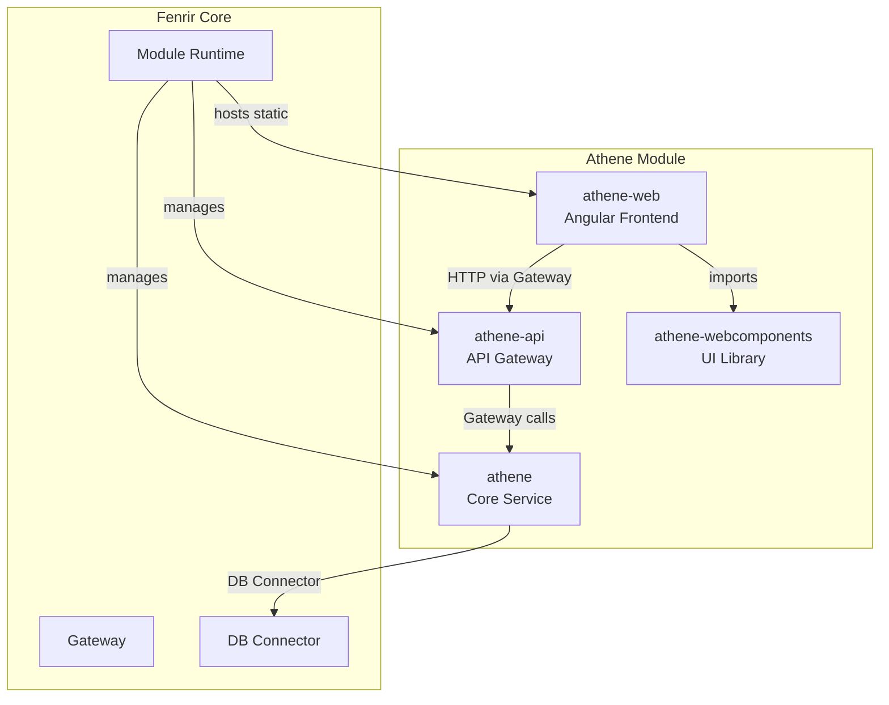
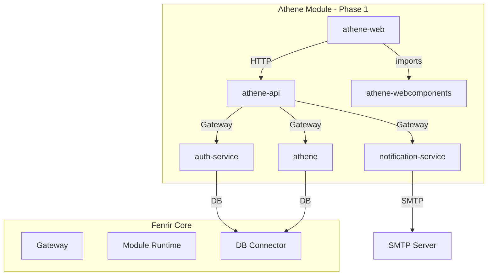
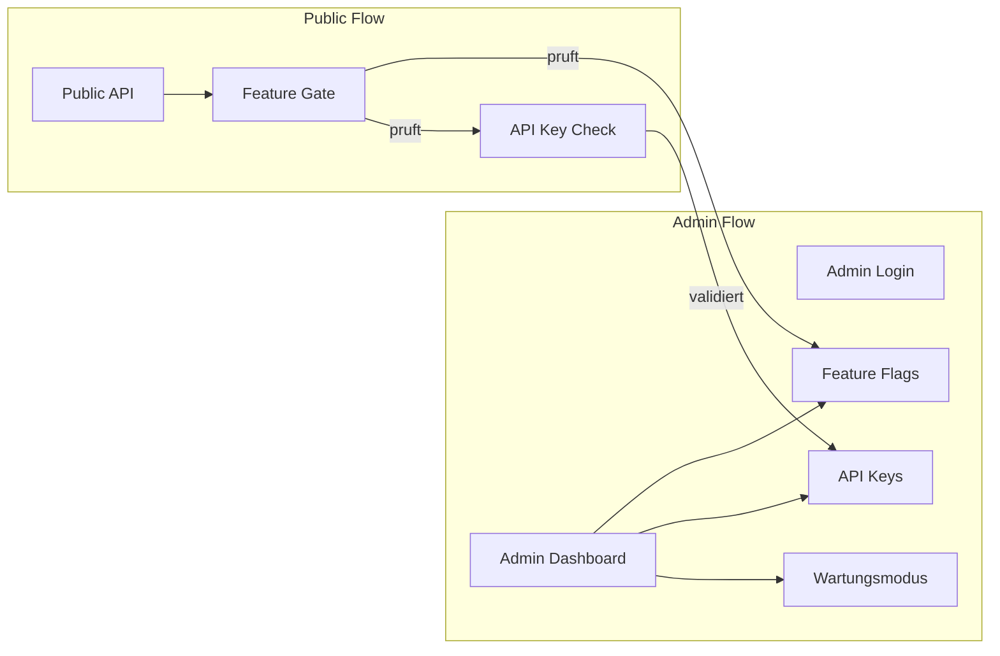
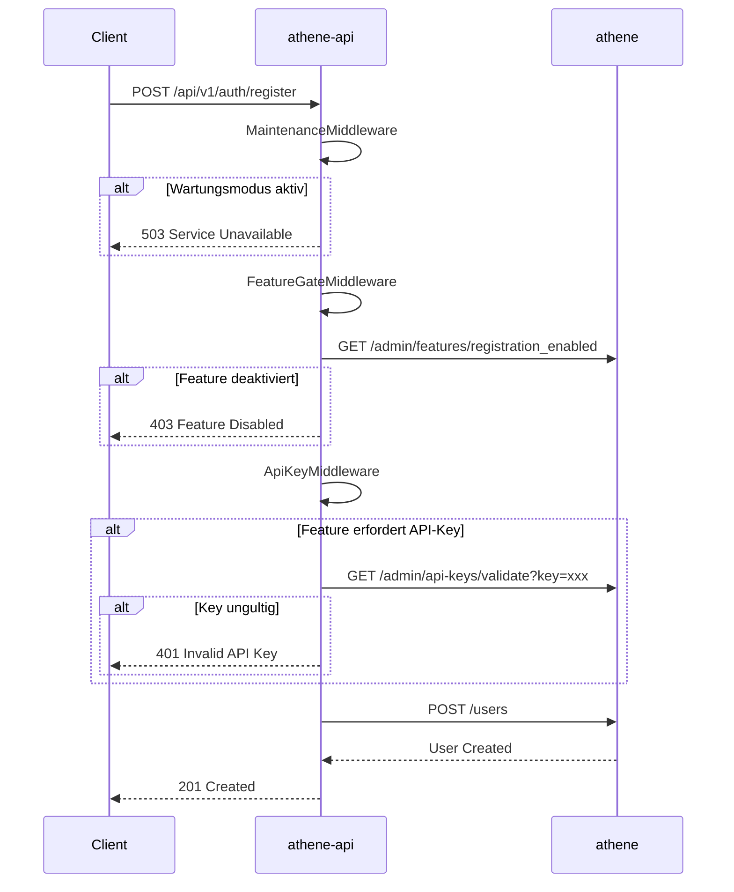
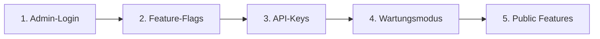

# Athene Phase 1 - Grundgerust

## Architektur-Ubersicht



## Reihenfolge der Entwicklung

Die Module mussen in einer bestimmten Reihenfolge entwickelt werden, da Abhangigkeiten bestehen:

1. **Design System** - Design Tokens, Icon-Library (Grundlage fur alles)
2. **DB-Schema** - Migrations fur alle Entities (inkl. UserSettings, EmailTemplates)
3. **athene-webcomponents** - UI-Komponenten + Skeleton Loaders + Storybook
4. **athene** - Core-Business-Logik + Feature-Flags + Settings + Audit
5. **auth-service** - Dedizierter Auth-Service (Login, Register, Sessions, Password-Reset)
6. **notification-service** - Email-Versand (Templates, Queue, SMTP-Integration)
7. **athene-api** - API-Gateway mit Security-Middlewares + OpenAPI
8. **athene-web** - Frontend mit Admin-Dashboard + konfigurierbare Shortcuts + i18n
9. **Testing** - Unit + Integration + E2E parallel zur Entwicklung
10. **CI/CD** - Pipeline fur alle 6 Module (nutzt Fenrir embedded DB)

---

## Modul-Ubersicht Phase 1



| Modul | Typ | Beschreibung |

|-------|-----|--------------|

| athene-webcomponents | Angular Library | UI-Komponenten + Storybook |

| athene | Rust Service | Core-Business-Logik |

| auth-service | Rust Service | Authentication + Sessions |

| notification-service | Rust Service | Email-Versand |

| athene-api | Rust Service | API-Gateway |

| athene-web | Angular App | Frontend + Admin

---

## Code-Styling-Richtlinien

Alle Module folgen strikten Strukturvorgaben fur Wartbarkeit und Lesbarkeit.

### Rust-Projekte (athene, auth-service, notification-service, athene-api)

**Grundprinzip:** Jede logische Einheit in eigenem File, gruppiert in Unterordnern.

```
src/
  main.rs                    # Nur Entry-Point
  lib.rs                     # Re-Exports
  
  domain/                    # Business-Logik (keine IO!)
    mod.rs                   # Re-Exports
    user/
      mod.rs
      model.rs               # User struct
      types.rs               # UserId, UserStatus enum
      error.rs               # UserError
      repository.rs          # Trait UserRepository
    session/
      mod.rs
      model.rs               # Session struct
      types.rs               # SessionId, SessionStatus
      builder.rs             # SessionBuilder
    
  services/                  # Use-Cases
    mod.rs
    user_service.rs
    auth_service.rs
    
  routes/                    # HTTP-Handler
    mod.rs
    user_routes.rs
    auth_routes.rs
    
  middleware/                # Axum Middlewares
    mod.rs
    auth.rs
    rate_limit.rs
    
  config/                    # Konfiguration
    mod.rs
    settings.rs
    
  error/                     # Globale Fehler
    mod.rs
    app_error.rs
    error_codes.rs
```

**Regeln fur Rust:**

1. **Ein Struct pro File** - `model.rs` enthalt nur das Model
2. **Enums in `types.rs`** - Alle zugehorigen Enums/NewTypes zusammen
3. **Errors separat** - `error.rs` pro Domain-Bereich
4. **Keine God-Files** - Max 200-300 Zeilen pro File
5. **mod.rs nur fur Re-Exports** - Keine Logik in mod.rs

**Beispiel - Falsch:**

```rust
// session.rs - FALSCH: Alles in einem File
pub enum SessionStatus { Active, Expired, Revoked }
pub struct SessionId(Uuid);
pub struct Session { ... }
impl Session { ... }
pub struct SessionBuilder { ... }
pub enum SessionError { ... }
```

**Beispiel - Richtig:**

```rust
// domain/session/mod.rs
mod model;
mod types;
mod builder;
mod error;

pub use model::Session;
pub use types::{SessionId, SessionStatus};
pub use builder::SessionBuilder;
pub use error::SessionError;
```
```rust
// domain/session/types.rs
use uuid::Uuid;

#[derive(Debug, Clone, Copy, PartialEq, Eq, Hash)]
pub struct SessionId(pub Uuid);

impl SessionId {
    pub fn new() -> Self { Self(Uuid::new_v4()) }
}

#[derive(Debug, Clone, Copy, PartialEq, Eq)]
pub enum SessionStatus {
    Active,
    Expired,
    Revoked,
}
```
```rust
// domain/session/model.rs
use super::types::{SessionId, SessionStatus};
use chrono::{DateTime, Utc};
use uuid::Uuid;

pub struct Session {
    pub id: SessionId,
    pub user_id: Uuid,
    pub status: SessionStatus,
    pub created_at: DateTime<Utc>,
    pub expires_at: DateTime<Utc>,
}
```

---

### Angular-Projekte (athene-web, athene-webcomponents)

**Grundprinzip:** Feature-basierte Ordnerstruktur, strikte Trennung von Concerns.

```
src/app/
  core/                      # Singleton-Services, Guards, Interceptors
    services/
      api.service.ts
      auth.service.ts
      user-settings.service.ts
    guards/
      auth.guard.ts
      admin.guard.ts
    interceptors/
      auth.interceptor.ts
      error.interceptor.ts
    
  shared/                    # Wiederverwendbare Komponenten/Pipes/Directives
    components/
      loading-spinner/
        loading-spinner.component.ts
        loading-spinner.component.scss
    pipes/
      date-format.pipe.ts
    directives/
      click-outside.directive.ts
    
  features/                  # Feature-Module
    admin/
      components/
        dashboard/
          dashboard.component.ts
          dashboard.component.html
          dashboard.component.scss
        feature-flags/
      services/
        admin.service.ts
      models/
        feature-flag.model.ts
        api-key.model.ts
      admin.routes.ts
      
    auth/
      components/
        login/
        register/
        password-reset/
      services/
        auth-feature.service.ts
      models/
        login-request.model.ts
      auth.routes.ts
      
  models/                    # Globale Models/Interfaces
    user.model.ts
    session.model.ts
    api-response.model.ts
    
  enums/                     # Globale Enums
    user-role.enum.ts
    session-status.enum.ts
    
  types/                     # TypeScript Types
    api-types.ts
```

**Regeln fur Angular:**

1. **Ein Model pro File** - `user.model.ts` enthalt nur User-Interface
2. **Enums separat** - `enums/` Ordner fur alle Enums
3. **Feature-Module** - Jedes Feature isoliert mit eigenen Services/Models
4. **Komponenten-Ordner** - Jede Komponente in eigenem Ordner (ts, html, scss)
5. **Barrel Exports** - `index.ts` fur saubere Imports
6. **Max 200 Zeilen** - Komponenten aufteilen wenn grosser

**Beispiel - Models:**

```typescript
// models/user.model.ts
import { UserRole } from '../enums/user-role.enum';

export interface User {
  id: string;
  email: string;
  displayName: string;
  role: UserRole;
  createdAt: Date;
}
```
```typescript
// enums/user-role.enum.ts
export enum UserRole {
  Admin = 'admin',
  Operator = 'operator',
  User = 'user',
}
```
```typescript
// models/index.ts (Barrel Export)
export * from './user.model';
export * from './session.model';
```

---

### SCSS-Struktur

```
styles/
  _tokens.scss               # Design Tokens
  _mixins.scss               # Wiederverwendbare Mixins
  _typography.scss           # Font-Definitionen
  _animations.scss           # Keyframes
  _reset.scss                # CSS Reset
  main.scss                  # Imports alles
```

**Regeln fur SCSS:**

1. **Partials mit Underscore** - `_tokens.scss`
2. **Keine Magic Numbers** - Immer Tokens verwenden
3. **BEM-Naming** - `.block__element--modifier`
4. **Max 1 Level Nesting** - Fur Lesbarkeit

---

### Naming Conventions

| Sprache | Typ | Convention | Beispiel |

|---------|-----|------------|----------|

| Rust | Structs | PascalCase | `UserSession` |

| Rust | Enums | PascalCase | `SessionStatus` |

| Rust | Functions | snake_case | `get_user_by_id` |

| Rust | Files | snake_case | `user_service.rs` |

| TS | Interfaces | PascalCase | `UserResponse` |

| TS | Enums | PascalCase | `UserRole` |

| TS | Functions | camelCase | `getUserById` |

| TS | Files | kebab-case | `user.service.ts` |

| SCSS | Variables | kebab-case | `$color-primary` |

---

### Imports-Reihenfolge

**Rust:**

```rust
// 1. Standard Library
use std::collections::HashMap;

// 2. External Crates
use axum::{Router, routing::get};
use serde::{Deserialize, Serialize};

// 3. Crate Modules
use crate::config::Settings;
use crate::domain::user::User;

// 4. Super/Self
use super::types::SessionId;
```

**TypeScript:**

```typescript
// 1. Angular Core
import { Injectable, inject } from '@angular/core';

// 2. RxJS
import { Observable, map } from 'rxjs';

// 3. Third-Party
import { format } from 'date-fns';

// 4. App Modules (Absolute)
import { ApiService } from '@core/services/api.service';
import { User } from '@models/user.model';

// 5. Relative
import { FeatureFlag } from '../models/feature-flag.model';
```

---

### Linting & Formatting

**Rust (.rustfmt.toml):**

```toml
edition = "2021"
max_width = 100
tab_spaces = 4
imports_granularity = "Module"
group_imports = "StdExternalCrate"
```

**Angular (.prettierrc):**

```json
{
  "singleQuote": true,
  "trailingComma": "es5",
  "tabWidth": 2,
  "semi": true,
  "printWidth": 100
}
```

**ESLint (Auszug):**

```json
{
  "rules": {
    "@typescript-eslint/no-explicit-any": "error",
    "max-lines": ["warn", { "max": 200 }],
    "max-lines-per-function": ["warn", { "max": 50 }]
  }
}
```

---

## Design System

### Design Tokens

Zentrale Definition aller visuellen Variablen fur Konsistenz und einfaches Theming.

**Datei:** `athene-webcomponents/src/lib/styles/_tokens.scss`

```scss
// ===========================================
// ATHENE DESIGN TOKENS
// ===========================================

:root {
  // ---------------------
  // FARBEN - Basis
  // ---------------------
  --ath-primary: #3b82f6;
  --ath-primary-hover: #2563eb;
  --ath-primary-light: #dbeafe;
  
  --ath-secondary: #64748b;
  --ath-secondary-hover: #475569;
  
  --ath-danger: #ef4444;
  --ath-danger-hover: #dc2626;
  --ath-danger-light: #fee2e2;
  
  --ath-success: #22c55e;
  --ath-success-light: #dcfce7;
  
  --ath-warning: #f59e0b;
  --ath-warning-light: #fef3c7;
  
  // ---------------------
  // FARBEN - Neutral
  // ---------------------
  --ath-bg: #ffffff;
  --ath-bg-secondary: #f8fafc;
  --ath-bg-tertiary: #f1f5f9;
  
  --ath-text: #1e293b;
  --ath-text-secondary: #64748b;
  --ath-text-muted: #94a3b8;
  
  --ath-border: #e2e8f0;
  --ath-border-strong: #cbd5e1;
  
  // ---------------------
  // ABSTANDE
  // ---------------------
  --ath-space-xs: 0.25rem;   // 4px
  --ath-space-sm: 0.5rem;    // 8px
  --ath-space-md: 1rem;      // 16px
  --ath-space-lg: 1.5rem;    // 24px
  --ath-space-xl: 2rem;      // 32px
  --ath-space-2xl: 3rem;     // 48px
  
  // ---------------------
  // BORDER RADIUS
  // ---------------------
  --ath-radius-sm: 0.25rem;  // 4px
  --ath-radius-md: 0.375rem; // 6px
  --ath-radius-lg: 0.5rem;   // 8px
  --ath-radius-xl: 0.75rem;  // 12px
  --ath-radius-full: 9999px;
  
  // ---------------------
  // SCHATTEN
  // ---------------------
  --ath-shadow-sm: 0 1px 2px 0 rgb(0 0 0 / 0.05);
  --ath-shadow-md: 0 4px 6px -1px rgb(0 0 0 / 0.1);
  --ath-shadow-lg: 0 10px 15px -3px rgb(0 0 0 / 0.1);
  --ath-shadow-xl: 0 20px 25px -5px rgb(0 0 0 / 0.1);
  
  // ---------------------
  // TYPOGRAFIE
  // ---------------------
  --ath-font-sans: 'Inter', -apple-system, BlinkMacSystemFont, sans-serif;
  --ath-font-mono: 'JetBrains Mono', 'Fira Code', monospace;
  
  --ath-text-xs: 0.75rem;    // 12px
  --ath-text-sm: 0.875rem;   // 14px
  --ath-text-base: 1rem;     // 16px
  --ath-text-lg: 1.125rem;   // 18px
  --ath-text-xl: 1.25rem;    // 20px
  --ath-text-2xl: 1.5rem;    // 24px
  
  // ---------------------
  // TRANSITIONS
  // ---------------------
  --ath-transition-fast: 150ms ease;
  --ath-transition-base: 200ms ease;
  --ath-transition-slow: 300ms ease;
  
  // ---------------------
  // Z-INDEX
  // ---------------------
  --ath-z-dropdown: 100;
  --ath-z-modal: 200;
  --ath-z-toast: 300;
  --ath-z-tooltip: 400;
}

// ===========================================
// DARK MODE
// ===========================================

[data-theme="dark"] {
  --ath-primary: #60a5fa;
  --ath-primary-hover: #93c5fd;
  --ath-primary-light: #1e3a5f;
  
  --ath-bg: #0f172a;
  --ath-bg-secondary: #1e293b;
  --ath-bg-tertiary: #334155;
  
  --ath-text: #f1f5f9;
  --ath-text-secondary: #94a3b8;
  --ath-text-muted: #64748b;
  
  --ath-border: #334155;
  --ath-border-strong: #475569;
  
  --ath-danger-light: #450a0a;
  --ath-success-light: #052e16;
  --ath-warning-light: #451a03;
}
```

### Icon-Library (Lucide)

**Installation:**

```bash
cd athene-webcomponents
npm install lucide-angular
```

**Setup:**

```typescript
// athene-webcomponents/src/lib/icons/icons.module.ts
import { NgModule } from '@angular/core';
import { LucideAngularModule } from 'lucide-angular';
import {
  Home, Users, Folder, Ticket, Settings, Search,
  Plus, Edit, Trash, Check, X, AlertCircle,
  ChevronDown, ChevronRight, Menu, LogOut,
  Moon, Sun, Bell, Key, Shield, Clock
} from 'lucide-angular';

const icons = {
  Home, Users, Folder, Ticket, Settings, Search,
  Plus, Edit, Trash, Check, X, AlertCircle,
  ChevronDown, ChevronRight, Menu, LogOut,
  Moon, Sun, Bell, Key, Shield, Clock
};

@NgModule({
  imports: [LucideAngularModule.pick(icons)],
  exports: [LucideAngularModule]
})
export class AthIconsModule {}
```

**Verwendung:**

```html
<lucide-icon name="home" [size]="20"></lucide-icon>
<lucide-icon name="users" [size]="24" [strokeWidth]="2"></lucide-icon>
```

### Theme-Switching

````typescript
// athene-web/src/app/core/services/theme.service.ts
@Injectable({ providedIn: 'root' })
export class ThemeService {
  private theme = signal<'light' | 'dark'>('light');
  
  constructor() {
    // System-Preference erkennen
    const prefersDark = window.matchMedia('(prefers-color-scheme: dark)').matches;
    const saved = localStorage.getItem('ath-theme');
    this.setTheme(saved as any || (prefersDark ? 'dark' : 'light'));
  }
  
  setTheme(theme: 'light' | 'dark') {
    this.theme.set(theme);
    document.documentElement.setAttribute('data-theme', theme);
    localStorage.setItem('ath-theme', theme);
  }
  
  toggle() {
    this.setTheme(this.theme() === 'light' ? 'dark' : 'light');
  }
  
  current = this.theme.asReadonly();
}

---

## Initial Admin Setup (Setup-Token)

Der erste Admin-Account wird sicher uber ein Setup-Token erstellt:

```mermaid
flowchart TD
    Start[Erster Start] --> Check{Admin existiert?}
    Check -->|Ja| Normal[Normaler Betrieb]
    Check -->|Nein| Token[Generiere Setup-Token]
    Token --> Log[Token in Logs anzeigen]
    Log --> Methods{Setup-Methode}
    
    Methods -->|CLI| CLI[fenrir athene setup]
    Methods -->|Browser| Browser[/setup?token=xxx]
    
    CLI --> Password[Passwort-Eingabe]
    Browser --> PasswordForm[Passwort-Formular]
    
    Password --> Validate[Password-Policy prufen]
    PasswordForm --> Validate
    
    Validate --> Create[Admin erstellen]
    Create --> Audit[Audit-Event schreiben]
    Audit --> Invalidate[Token invalidieren]
    Invalidate --> Normal
````

**Ablauf:**

1. Beim ersten Start (kein Admin in DB) generiert das System einen Setup-Token
2. Token wird in Logs angezeigt: `ath_setup_a8f3b2c1d4e5...`
3. Token ist 30 Minuten gultig
4. Admin-Erstellung via CLI oder Browser
5. Nach Erstellung wird Token invalidiert und Setup-Route deaktiviert

**Fur Docker/K8s:**

```yaml
environment:
  ATHENE_ADMIN_EMAIL: admin@example.com
  # KEIN Passwort - Token aus Logs verwenden
```

---

## Security-Hardening

### Rate-Limiting

| Endpoint-Gruppe | Limit | Zeitfenster |

|-----------------|-------|-------------|

| Login | 5 Versuche | 15 Minuten |

| Register | 3 Versuche | 1 Stunde |

| API-Calls (Auth) | 100 Requests | 1 Minute |

| API-Calls (Public) | 60 Requests | 1 Minute |

| Admin-Endpoints | 30 Requests | 1 Minute |

### Account-Lockout

- Nach 5 fehlgeschlagenen Login-Versuchen: Account 15 Minuten gesperrt
- Nach 10 Versuchen: Account 1 Stunde gesperrt
- Nach 20 Versuchen: Account permanent gesperrt (Admin muss entsperren)
- Lockout-Events werden im Audit-Log protokolliert

### Session-Management

```rust
pub struct Session {
    pub id: Uuid,
    pub user_id: Uuid,
    pub token_hash: String,
    pub created_at: DateTime<Utc>,
    pub expires_at: DateTime<Utc>,
    pub last_activity: DateTime<Utc>,
    pub ip_address: Option<String>,
    pub user_agent: Option<String>,
    pub is_revoked: bool,
}
```

- Session-Timeout: 24 Stunden (konfigurierbar)
- Inaktivitats-Timeout: 2 Stunden
- Token-Refresh bei Aktivitat
- Alle Sessions eines Users konnen vom Admin widerrufen werden

### Password-Policy

| Regel | Wert |

|-------|------|

| Minimale Lange | 12 Zeichen |

| Grossbuchstaben | Mindestens 1 |

| Kleinbuchstaben | Mindestens 1 |

| Zahlen | Mindestens 1 |

| Sonderzeichen | Mindestens 1 |

| Nicht erlaubt | Email, Username, "password", "123456" |

---

## Validation-Layer

### Backend-Validation (athene + athene-api)

```rust
// validation/mod.rs
pub trait Validate {
    fn validate(&self) -> Result<(), ValidationError>;
}

// Beispiel: User-Registration
impl Validate for RegisterRequest {
    fn validate(&self) -> Result<(), ValidationError> {
        // Email-Format
        if !is_valid_email(&self.email) {
            return Err(ValidationError::InvalidEmail);
        }
        
        // Password-Policy
        validate_password(&self.password)?;
        
        // Display-Name
        if self.display_name.len() < 2 || self.display_name.len() > 50 {
            return Err(ValidationError::InvalidDisplayName);
        }
        
        Ok(())
    }
}
```

### Validation-Regeln

| Feld | Regeln |

|------|--------|

| `email` | RFC 5322 Format, max 255 Zeichen, Lowercase |

| `password` | Password-Policy (siehe oben) |

| `display_name` | 2-50 Zeichen, keine HTML-Tags |

| `team_name` | 2-100 Zeichen, alphanumerisch + Leerzeichen |

| `ticket_title` | 3-200 Zeichen |

| `ticket_description` | Max 10.000 Zeichen, Markdown erlaubt |

### Frontend-Validation (athene-web)

- Reactive Forms mit Validators
- Sofortiges Feedback bei Eingabe
- Gleiche Regeln wie Backend (DRY via shared Validation-Config)

---

## Audit-Logging

### Audit-Events

```rust
pub struct AuditEvent {
    pub id: Uuid,
    pub timestamp: DateTime<Utc>,
    pub actor_id: Option<Uuid>,      // Wer (null bei System-Events)
    pub actor_type: ActorType,       // User, Admin, System, ApiKey
    pub action: String,              // z.B. "user.login", "admin.feature.toggle"
    pub resource_type: String,       // z.B. "user", "feature_flag", "api_key"
    pub resource_id: Option<String>, // ID der betroffenen Ressource
    pub details: serde_json::Value,  // Zusatzliche Infos
    pub ip_address: Option<String>,
    pub user_agent: Option<String>,
    pub success: bool,
    pub error_code: Option<String>,
}
```

### Geloggte Aktionen

| Kategorie | Events |

|-----------|--------|

| Auth | `auth.login`, `auth.logout`, `auth.register`, `auth.password_reset`, `auth.lockout` |

| Admin | `admin.feature.toggle`, `admin.apikey.create`, `admin.apikey.revoke`, `admin.user.delete`, `admin.maintenance.enable` |

| User | `user.profile.update`, `user.password.change` |

| Session | `session.create`, `session.expire`, `session.revoke` |

| System | `system.setup.complete`, `system.migration.run` |

### Audit-Endpoints (Admin)

```
GET  /api/v1/admin/audit                    # Alle Events (paginiert)
GET  /api/v1/admin/audit/user/:id           # Events fur einen User
GET  /api/v1/admin/audit/resource/:type/:id # Events fur eine Ressource
GET  /api/v1/admin/audit/export             # CSV/JSON Export
```

---

## Error-Handling

### Error-Codes

Format: `ATH-<KATEGORIE>-<NUMMER>`

| Code | Bedeutung |

|------|-----------|

| `ATH-AUTH-001` | Invalid credentials |

| `ATH-AUTH-002` | Account locked |

| `ATH-AUTH-003` | Session expired |

| `ATH-AUTH-004` | Invalid API key |

| `ATH-AUTH-005` | Insufficient permissions |

| `ATH-VAL-001` | Invalid email format |

| `ATH-VAL-002` | Password too weak |

| `ATH-VAL-003` | Field too long |

| `ATH-VAL-004` | Required field missing |

| `ATH-FEAT-001` | Feature disabled |

| `ATH-FEAT-002` | API key required |

| `ATH-MAINT-001` | Maintenance mode active |

| `ATH-RATE-001` | Rate limit exceeded |

| `ATH-SYS-001` | Internal server error |

| `ATH-SYS-002` | Database error |

### Error-Response-Format

```json
{
  "error": {
    "code": "ATH-AUTH-001",
    "message": "Invalid email or password",
    "details": {
      "attempts_remaining": 3,
      "lockout_after": 5
    },
    "timestamp": "2026-01-29T10:30:00Z",
    "request_id": "req_abc123"
  }
}
```

---

## API-Dokumentation (OpenAPI)

### Swagger UI

- Verfugbar unter `/api/docs`
- Interaktive API-Exploration
- Try-it-out Funktion
- Authentication via Bearer Token

### OpenAPI Spec

```yaml
# openapi.yaml (Auszug)
openapi: 3.1.0
info:
  title: Athene API
  version: 1.0.0
  description: Ticketsystem API

servers:
  - url: /api/v1
    description: API v1

components:
  securitySchemes:
    bearerAuth:
      type: http
      scheme: bearer
    apiKeyAuth:
      type: apiKey
      in: header
      name: X-API-Key

  schemas:
    Error:
      type: object
      properties:
        code:
          type: string
          example: "ATH-AUTH-001"
        message:
          type: string
        details:
          type: object
```

### Generierung

- Rust: `utoipa` Crate fur automatische Spec-Generierung aus Code
- Annotations an Endpoints und Structs

---

## Internationalisierung (i18n)

### Frontend (athene-web)

```typescript
// i18n Setup mit @ngx-translate/core
export const appConfig: ApplicationConfig = {
  providers: [
    importProvidersFrom(
      TranslateModule.forRoot({
        loader: {
          provide: TranslateLoader,
          useFactory: (http: HttpClient) => 
            new TranslateHttpLoader(http, './assets/i18n/', '.json'),
          deps: [HttpClient]
        },
        defaultLanguage: 'de'
      })
    )
  ]
};
```

### Sprachdateien

```
src/assets/i18n/
  de.json    # Deutsch (Default)
  en.json    # Englisch (vorbereitet)
```

### Beispiel de.json

```json
{
  "auth": {
    "login": "Anmelden",
    "logout": "Abmelden",
    "register": "Registrieren",
    "email": "E-Mail",
    "password": "Passwort"
  },
  "errors": {
    "ATH-AUTH-001": "Ungultige E-Mail oder Passwort",
    "ATH-AUTH-002": "Konto gesperrt. Bitte spater erneut versuchen.",
    "ATH-VAL-002": "Passwort zu schwach"
  },
  "admin": {
    "dashboard": "Dashboard",
    "features": "Features",
    "apiKeys": "API-Schlussel",
    "maintenance": "Wartungsmodus"
  }
}
```

---

## Testing-Strategie

### Test-Pyramide

```
        /\
       /  \      E2E Tests (Cypress/Playwright)
      /----\     - Kritische User-Flows
     /      \    - Admin-Setup, Login, Feature-Toggle
    /--------\
   /          \  Integration Tests
  /            \ - API-Endpoints
 /--------------\- Middleware-Chain
/                \- DB-Queries
------------------
Unit Tests
- Domain-Logik
- Validation
- Services (mit Mocks)
```

### Unit Tests

**Rust (athene + athene-api):**

```rust
#[cfg(test)]
mod tests {
    use super::*;
    
    #[test]
    fn test_password_validation() {
        assert!(validate_password("Secure123!").is_ok());
        assert!(validate_password("weak").is_err());
    }
    
    #[test]
    fn test_email_validation() {
        assert!(is_valid_email("user@example.com"));
        assert!(!is_valid_email("invalid"));
    }
}
```

**Angular (athene-web + athene-webcomponents):**

```typescript
describe('AuthService', () => {
  it('should validate email format', () => {
    expect(service.isValidEmail('user@example.com')).toBe(true);
    expect(service.isValidEmail('invalid')).toBe(false);
  });
});
```

### Integration Tests

```rust
#[tokio::test]
async fn test_login_rate_limiting() {
    let app = create_test_app().await;
    
    // 5 fehlgeschlagene Logins
    for _ in 0..5 {
        let res = app.post("/api/v1/auth/login")
            .json(&json!({"email": "test@test.com", "password": "wrong"}))
            .await;
        assert_eq!(res.status(), 401);
    }
    
    // 6. Versuch sollte Rate-Limited sein
    let res = app.post("/api/v1/auth/login")
        .json(&json!({"email": "test@test.com", "password": "wrong"}))
        .await;
    assert_eq!(res.status(), 429);
    assert_eq!(res.json().error.code, "ATH-RATE-001");
}
```

### E2E Tests (Playwright)

```typescript
test('Admin can toggle feature flag', async ({ page }) => {
  // Login als Admin
  await page.goto('/login');
  await page.fill('[data-testid="email"]', 'admin@example.com');
  await page.fill('[data-testid="password"]', 'SecurePass123!');
  await page.click('[data-testid="login-button"]');
  
  // Zum Feature-Flags navigieren
  await page.goto('/admin/features');
  
  // Feature togglen
  const toggle = page.locator('[data-testid="feature-registration_enabled"]');
  await expect(toggle).toHaveAttribute('aria-checked', 'false');
  await toggle.click();
  await expect(toggle).toHaveAttribute('aria-checked', 'true');
  
  // Verifizieren dass Registrierung jetzt moglich ist
  await page.goto('/register');
  await expect(page.locator('form')).toBeVisible();
});
```

---

## CI/CD Pipeline

### GitHub Actions

```yaml
# .github/workflows/ci.yml
name: CI

on:
  push:
    branches: [main, develop]
  pull_request:
    branches: [main]

jobs:
  # Backend (Rust)
  backend-lint:
    runs-on: ubuntu-latest
    steps:
      - uses: actions/checkout@v4
      - uses: dtolnay/rust-toolchain@stable
        with:
          components: rustfmt, clippy
      - run: cargo fmt --check
        working-directory: modules/athene
      - run: cargo clippy -- -D warnings
        working-directory: modules/athene

  backend-test:
    runs-on: ubuntu-latest
    # Kein Docker-Postgres nötig - Tests nutzen Fenrir's embedded SQLite
    steps:
      - uses: actions/checkout@v4
      - uses: dtolnay/rust-toolchain@stable
      - run: cargo test
        working-directory: modules/athene
        env:
          FENRIR_DB_MODE: embedded
          FENRIR_DB_ENGINE: sqlite  # Embedded SQLite fur Tests

  # Frontend (Angular)
  frontend-lint:
    runs-on: ubuntu-latest
    steps:
      - uses: actions/checkout@v4
      - uses: actions/setup-node@v4
        with:
          node-version: 20
      - run: npm ci
        working-directory: modules/athene-web
      - run: npm run lint
        working-directory: modules/athene-web

  frontend-test:
    runs-on: ubuntu-latest
    steps:
      - uses: actions/checkout@v4
      - uses: actions/setup-node@v4
        with:
          node-version: 20
      - run: npm ci
        working-directory: modules/athene-web
      - run: npm test -- --watch=false --browsers=ChromeHeadless
        working-directory: modules/athene-web

  # E2E Tests
  e2e:
    runs-on: ubuntu-latest
    needs: [backend-test, frontend-test]
    steps:
      - uses: actions/checkout@v4
      - name: Start Services
        run: docker-compose up -d
      - name: Run Playwright
        run: npx playwright test
        working-directory: modules/athene-web

  # Security Scan
  security:
    runs-on: ubuntu-latest
    steps:
      - uses: actions/checkout@v4
      - name: Rust Security Audit
        run: cargo audit
        working-directory: modules/athene
      - name: npm Audit
        run: npm audit --audit-level=high
        working-directory: modules/athene-web
```

---

## DB-Schema (Migrations)

### Tabellen-Ubersicht

```
users
  - id (UUID, PK)
  - email (VARCHAR, UNIQUE)
  - password_hash (VARCHAR)
  - display_name (VARCHAR)
  - role (VARCHAR)
  - is_active (BOOLEAN)
  - lockout_until (TIMESTAMP, NULL)
  - failed_login_attempts (INT)
  - created_at (TIMESTAMP)
  - updated_at (TIMESTAMP)

sessions
  - id (UUID, PK)
  - user_id (UUID, FK)
  - token_hash (VARCHAR)
  - expires_at (TIMESTAMP)
  - last_activity (TIMESTAMP)
  - ip_address (VARCHAR, NULL)
  - user_agent (VARCHAR, NULL)
  - is_revoked (BOOLEAN)
  - created_at (TIMESTAMP)

feature_flags
  - key (VARCHAR, PK)
  - enabled (BOOLEAN)
  - description (TEXT)
  - requires_api_key (BOOLEAN)
  - updated_at (TIMESTAMP)
  - updated_by (UUID, FK, NULL)

api_keys
  - id (UUID, PK)
  - key_hash (VARCHAR)
  - name (VARCHAR)
  - created_by (UUID, FK)
  - expires_at (TIMESTAMP, NULL)
  - allowed_features (JSONB)
  - is_active (BOOLEAN)
  - last_used_at (TIMESTAMP, NULL)
  - created_at (TIMESTAMP)

app_settings
  - key (VARCHAR, PK)
  - value (JSONB)
  - updated_at (TIMESTAMP)
  - updated_by (UUID, FK, NULL)

audit_logs
  - id (UUID, PK)
  - timestamp (TIMESTAMP)
  - actor_id (UUID, NULL)
  - actor_type (VARCHAR)
  - action (VARCHAR)
  - resource_type (VARCHAR)
  - resource_id (VARCHAR, NULL)
  - details (JSONB)
  - ip_address (VARCHAR, NULL)
  - user_agent (VARCHAR, NULL)
  - success (BOOLEAN)
  - error_code (VARCHAR, NULL)

setup_tokens
  - id (UUID, PK)
  - token_hash (VARCHAR)
  - expires_at (TIMESTAMP)
  - used_at (TIMESTAMP, NULL)
  - created_at (TIMESTAMP)

teams (fur spater)
projects (fur spater)
tickets (fur spater)
```

---

## Admin-System Konzept

### Architektur



### Feature-Flags (in athene Core)

| Flag | Beschreibung | Default |

|------|--------------|---------|

| `registration_enabled` | Offentliche Registrierung erlaubt | `false` |

| `registration_requires_api_key` | Registrierung nur mit API-Key | `true` |

| `maintenance_mode` | Wartungsmodus aktiv | `false` |

| `beta_features_enabled` | Beta-Features sichtbar | `false` |

| `invite_only` | Nur Einladungen erlaubt | `true` |

### API-Keys

- Admin kann API-Keys generieren
- Keys haben optionales Ablaufdatum
- Keys konnen bestimmten Features zugeordnet werden
- Nutzung wird geloggt

### Wartungsmodus

- Alle Public-Endpoints geben 503 + Wartungs-Message zuruck
- Admin-Endpoints bleiben erreichbar
- Frontend zeigt Wartungs-Page

---

## 1. athene-webcomponents (Angular UI Library)

**Pfad:** `/opt/fenrir/development/modules/athene-webcomponents`

### Struktur

```
athene-webcomponents/
  ng-package.json
  package.json
  tsconfig.json
  tsconfig.lib.json
  .storybook/              # NEU: Storybook Config
    main.ts
    preview.ts
    manager.ts
  src/
    public-api.ts
    lib/
      athene-webcomponents.module.ts
      components/
        button/
          button.component.ts
          button.component.scss
          button.component.spec.ts
          button.stories.ts     # NEU: Storybook Stories
        input/
        table/
        modal/
        card/
        sidebar/
        header/
        toast/
        spinner/
      styles/
        _variables.scss
        _mixins.scss
```

### Storybook Setup

Storybook dient als interaktiver Playground fur alle Komponenten.

**Installation:**

```bash
cd athene-webcomponents
npx storybook@latest init --type angular
```

**Starten:**

```bash
npm run storybook
# Offnet http://localhost:6006
```

### Story-Beispiel (Button)

```typescript
// button.stories.ts
import type { Meta, StoryObj } from '@storybook/angular';
import { AthButtonComponent } from './button.component';

const meta: Meta<AthButtonComponent> = {
  title: 'Components/Button',
  component: AthButtonComponent,
  tags: ['autodocs'],
  argTypes: {
    variant: {
      control: 'select',
      options: ['primary', 'secondary', 'danger', 'ghost'],
      description: 'Button-Variante'
    },
    size: {
      control: 'select',
      options: ['sm', 'md', 'lg'],
      description: 'Button-Grosse'
    },
    disabled: {
      control: 'boolean',
      description: 'Deaktiviert den Button'
    },
    loading: {
      control: 'boolean',
      description: 'Zeigt Loading-Spinner'
    }
  }
};

export default meta;
type Story = StoryObj<AthButtonComponent>;

// Default Story
export const Primary: Story = {
  args: {
    variant: 'primary',
    size: 'md',
    disabled: false,
    loading: false
  },
  render: (args) => ({
    props: args,
    template: `<ath-button [variant]="variant" [size]="size" [disabled]="disabled" [loading]="loading">
      Klick mich
    </ath-button>`
  })
};

// Weitere Varianten
export const Secondary: Story = {
  args: { ...Primary.args, variant: 'secondary' },
  render: Primary.render
};

export const Danger: Story = {
  args: { ...Primary.args, variant: 'danger' },
  render: Primary.render
};

export const Loading: Story = {
  args: { ...Primary.args, loading: true },
  render: Primary.render
};

export const AllSizes: Story = {
  render: () => ({
    template: `
      <div style="display: flex; gap: 1rem; align-items: center;">
        <ath-button size="sm">Small</ath-button>
        <ath-button size="md">Medium</ath-button>
        <ath-button size="lg">Large</ath-button>
      </div>
    `
  })
};
```

### Storybook Features

| Feature | Nutzen |

|---------|--------|

| **Controls Panel** | Props live anpassen und testen |

| **Actions Panel** | Events sehen (click, change, etc.) |

| **Docs Mode** | Auto-generierte Dokumentation |

| **Viewport Addon** | Responsive Testing (Mobile, Tablet, Desktop) |

| **A11y Addon** | Accessibility-Checks |

| **Dark Mode** | Theme-Switching testen |

### Storybook Addons

```typescript
// .storybook/main.ts
import type { StorybookConfig } from '@storybook/angular';

const config: StorybookConfig = {
  stories: ['../src/**/*.stories.@(js|jsx|ts|tsx)'],
  addons: [
    '@storybook/addon-essentials',    // Controls, Actions, Docs
    '@storybook/addon-a11y',          // Accessibility
    '@storybook/addon-viewport',      // Responsive
    'storybook-dark-mode',            // Dark/Light Toggle
  ],
  framework: {
    name: '@storybook/angular',
    options: {}
  }
};

export default config;
```

### Story-Struktur pro Komponente

Jede Komponente sollte folgende Stories haben:

```
components/
  button/
    button.stories.ts
      - Default (Basis-Variante)
      - AllVariants (Ubersicht aller Varianten)
      - AllSizes (Grossenvergleich)
      - States (Disabled, Loading, Error)
      - WithIcon (Icon-Kombinationen)
      - Playground (Alle Controls freigeschaltet)
```

### npm Scripts

```json
{
  "scripts": {
    "storybook": "storybook dev -p 6006",
    "build-storybook": "storybook build -o dist-storybook",
    "test-storybook": "test-storybook"
  }
}
```

### Erste Komponenten (Prioritat)

| Komponente | Beschreibung |

|------------|--------------|

| `ath-button` | Primary/Secondary/Danger Buttons |

| `ath-input` | Text-Input mit Validation |

| `ath-card` | Content Container |

| `ath-sidebar` | Navigation Sidebar |

| `ath-header` | App Header mit User-Menu |

| `ath-table` | Sortierbare Datentabelle |

| `ath-toast` | Notifications |

| `ath-spinner` | Loading Indicator |

| `ath-modal` | Dialog-Fenster |

### Skeleton Loaders

Skeleton-Komponenten fur bessere Loading-UX (statt nur Spinner):

```typescript
@Component({
  selector: 'ath-skeleton',
  template: `<div class="ath-skeleton" [style.width]="width" [style.height]="height"></div>`,
  styles: [`
    .ath-skeleton {
      background: linear-gradient(90deg, var(--ath-bg-tertiary) 25%, var(--ath-bg-secondary) 50%, var(--ath-bg-tertiary) 75%);
      background-size: 200% 100%;
      animation: shimmer 1.5s infinite;
      border-radius: var(--ath-radius-md);
    }
    @keyframes shimmer {
      0% { background-position: 200% 0; }
      100% { background-position: -200% 0; }
    }
  `]
})
export class AthSkeletonComponent {
  @Input() width = '100%';
  @Input() height = '1rem';
}
```

**Verwendung:**

```html
@if (loading()) {
  <ath-skeleton-table [rows]="5" />
} @else {
  <ath-table [data]="users()" />
}
```

### Technologie

- Angular 18+ (Standalone Components)
- SCSS mit Design Tokens (CSS Custom Properties)
- Lucide Icons
- Dark/Light Theme Support
- Skeleton Loaders fur Loading States

---

## 2. athene (Core Backend Service)

**Pfad:** `/opt/fenrir/development/modules/athene`

### Struktur

```
athene/
  Cargo.toml
  .fenrir/
    runtime.toml
    config.toml
  .fenrir-dev.toml
  src/
    main.rs
    lib.rs
    domain/
      user.rs
      team.rs
      project.rs
      ticket.rs
      feature_flag.rs      # NEU: Feature-Flags
      api_key.rs           # NEU: API-Keys
      app_settings.rs      # NEU: App-Einstellungen
    services/
      user_service.rs
      team_service.rs
      project_service.rs
      ticket_service.rs
      admin_service.rs     # NEU: Admin-Funktionen
      feature_service.rs   # NEU: Feature-Flag-Verwaltung
      api_key_service.rs   # NEU: API-Key-Verwaltung
    routes.rs
    error.rs
```

### Domain-Modelle (Admin)

```rust
// feature_flag.rs
pub struct FeatureFlag {
    pub key: String,
    pub enabled: bool,
    pub description: String,
    pub requires_api_key: bool,
    pub updated_at: DateTime<Utc>,
    pub updated_by: Option<Uuid>,
}

// api_key.rs
pub struct ApiKey {
    pub id: Uuid,
    pub key_hash: String,        // Gehashter Key
    pub name: String,            // z.B. "Beta-Tester Max"
    pub created_by: Uuid,
    pub created_at: DateTime<Utc>,
    pub expires_at: Option<DateTime<Utc>>,
    pub allowed_features: Vec<String>,  // z.B. ["registration"]
    pub is_active: bool,
    pub last_used_at: Option<DateTime<Utc>>,
}

// app_settings.rs
pub struct AppSettings {
    pub maintenance_mode: bool,
    pub maintenance_message: Option<String>,
    pub registration_mode: RegistrationMode,
    pub default_user_role: String,
}

pub enum RegistrationMode {
    Disabled,           // Keine Registrierung
    ApiKeyOnly,         // Nur mit API-Key
    InviteOnly,         // Nur mit Einladung
    Open,               // Offen fur alle
}
```

### Cargo.toml Dependencies

```toml
[dependencies]
fenrir-module-kit = { path = "../../module-kit" }
axum = "0.7"
tokio = { version = "1", features = ["full"] }
serde = { version = "1", features = ["derive"] }
serde_json = "1"
uuid = { version = "1", features = ["v4", "serde"] }
chrono = { version = "0.4", features = ["serde"] }
tracing = "0.1"
tracing-subscriber = "0.3"
```

### .fenrir/runtime.toml

```toml
[runtime]
mode = "process"
```

### Core-Endpoints (intern, via Gateway erreichbar)

**User/Teams/Tickets:**

- `GET /users/:id` - User abrufen
- `POST /users` - User erstellen
- `GET /teams` - Teams auflisten
- `POST /teams` - Team erstellen
- `GET /projects/:id` - Projekt abrufen
- `GET /tickets` - Tickets auflisten
- `POST /tickets` - Ticket erstellen

**Admin-Endpoints (intern):**

- `GET /admin/settings` - App-Settings abrufen
- `PATCH /admin/settings` - App-Settings andern
- `GET /admin/features` - Alle Feature-Flags
- `PATCH /admin/features/:key` - Feature-Flag andern
- `GET /admin/api-keys` - Alle API-Keys
- `POST /admin/api-keys` - Neuen API-Key erstellen
- `DELETE /admin/api-keys/:id` - API-Key loschen
- `POST /admin/api-keys/:id/revoke` - API-Key deaktivieren
- `GET /admin/api-keys/validate` - API-Key validieren (fur Gate)

---

## 3. auth-service (Authentication Service)

**Pfad:** `/opt/fenrir/development/modules/auth-service`

Dedizierter Service fur alle Authentifizierungs-Funktionen. Wird von athene-api via Gateway aufgerufen.

### Struktur

```
auth-service/
  Cargo.toml
  .fenrir/
    runtime.toml
  .fenrir-dev.toml
  src/
    main.rs
    domain/
      user.rs
      session.rs
      password_reset.rs
    services/
      auth_service.rs
      session_service.rs
      password_service.rs
    routes.rs
    error.rs
```

### Domain-Modelle

```rust
// session.rs
pub struct Session {
    pub id: Uuid,
    pub user_id: Uuid,
    pub token_hash: String,
    pub created_at: DateTime<Utc>,
    pub expires_at: DateTime<Utc>,
    pub last_activity: DateTime<Utc>,
    pub ip_address: Option<String>,
    pub user_agent: Option<String>,
    pub is_revoked: bool,
}

// password_reset.rs
pub struct PasswordResetToken {
    pub id: Uuid,
    pub user_id: Uuid,
    pub token_hash: String,
    pub created_at: DateTime<Utc>,
    pub expires_at: DateTime<Utc>,
    pub used_at: Option<DateTime<Utc>>,
}
```

### Endpoints (intern)

```
POST   /auth/login              # Login, erstellt Session
POST   /auth/logout             # Logout, invalidiert Session
POST   /auth/register           # Neuen User erstellen
POST   /auth/refresh            # Session-Token erneuern
GET    /auth/validate           # Session validieren
POST   /auth/password/reset     # Password-Reset anfordern
POST   /auth/password/confirm   # Password-Reset bestatigen
GET    /auth/sessions           # Alle Sessions eines Users
DELETE /auth/sessions/:id       # Session widerrufen
DELETE /auth/sessions           # Alle Sessions widerrufen
```

### Security-Features

- Argon2 Password-Hashing (via Fenrir SecurityManager)
- Session-Token mit HMAC-Signatur
- Rate-Limiting (Login: 5/15min, Reset: 3/1h)
- Account-Lockout nach Fehlversuchen
- Audit-Events fur alle Auth-Aktionen

---

## 4. notification-service (Email Service)

**Pfad:** `/opt/fenrir/development/modules/notification-service`

Service fur Email-Versand mit Template-System und Queue.

### Struktur

```
notification-service/
  Cargo.toml
  .fenrir/
    runtime.toml
  .fenrir-dev.toml
  src/
    main.rs
    domain/
      email.rs
      template.rs
      queue.rs
    services/
      email_service.rs
      template_service.rs
      queue_service.rs
    templates/           # Email-Templates
      welcome.html
      password_reset.html
      api_key_created.html
      team_invite.html
    routes.rs
    error.rs
```

### Domain-Modelle

```rust
// email.rs
pub struct Email {
    pub id: Uuid,
    pub to: String,
    pub subject: String,
    pub body_html: String,
    pub body_text: Option<String>,
    pub template_id: Option<String>,
    pub template_data: Option<serde_json::Value>,
    pub status: EmailStatus,
    pub created_at: DateTime<Utc>,
    pub sent_at: Option<DateTime<Utc>>,
    pub error: Option<String>,
}

pub enum EmailStatus {
    Queued,
    Sending,
    Sent,
    Failed,
}

// template.rs
pub struct EmailTemplate {
    pub id: String,           // z.B. "welcome", "password_reset"
    pub subject: String,
    pub body_html: String,
    pub body_text: Option<String>,
    pub variables: Vec<String>,  // Erwartete Variablen
}
```

### Email-Templates

| Template | Trigger | Variablen |

|----------|---------|-----------|

| `welcome` | User-Registrierung | `user_name`, `login_url` |

| `password_reset` | Password-Reset | `user_name`, `reset_url`, `expires_in` |

| `api_key_created` | Admin erstellt API-Key | `key_name`, `key_preview`, `expires_at` |

| `team_invite` | Team-Einladung | `inviter_name`, `team_name`, `invite_url` |

| `account_locked` | Account gesperrt | `user_name`, `unlock_time`, `reason` |

### Endpoints (intern)

```
POST   /notifications/send           # Email direkt senden
POST   /notifications/queue          # Email in Queue einreihen
GET    /notifications/queue          # Queue-Status
GET    /notifications/:id            # Email-Status abfragen
GET    /notifications/templates      # Alle Templates
GET    /notifications/templates/:id  # Template abrufen
```

### Konfiguration

```toml
# In Fenrir config oder .fenrir-dev.toml
[notification]
smtp_host = "env:SMTP_HOST"
smtp_port = 587
smtp_user = "env:SMTP_USER"
smtp_password = "env:SMTP_PASSWORD"
from_email = "noreply@athene.example.com"
from_name = "Athene"

[notification.queue]
batch_size = 10
retry_attempts = 3
retry_delay_seconds = 60
```

### Dev-Mode

Im Development werden Emails nicht wirklich gesendet, sondern:

1. In Logs ausgegeben
2. In `runtime/emails/` als HTML-Dateien gespeichert
3. Uber Admin-Dashboard einsehbar

---

## 5. athene-api (API Gateway)

> Hinweis: athene-api routet Auth-Requests an auth-service und Email-Requests an notification-service.

**Pfad:** `/opt/fenrir/development/modules/athene-api`

### Struktur

```
athene-api/
  Cargo.toml
  .fenrir/
    runtime.toml
  .fenrir-dev.toml
  src/
    main.rs
    routes/
      mod.rs
      auth.rs
      users.rs
      teams.rs
      projects.rs
      tickets.rs
      admin.rs             # NEU: Admin-Routes
    middleware/
      mod.rs
      auth.rs
      feature_gate.rs      # NEU: Feature-Gate
      maintenance.rs       # NEU: Wartungsmodus-Check
      api_key.rs           # NEU: API-Key-Validation
    error.rs
```

### Verantwortlichkeiten

- Public HTTP API (`/api/v1/*`)
- Admin HTTP API (`/api/v1/admin/*`)
- Request-Routing zu athene-core via Gateway
- **Feature-Gate-Middleware** - Pruft ob Feature aktiviert ist
- **Maintenance-Middleware** - Blockiert bei Wartungsmodus
- **API-Key-Middleware** - Validiert API-Keys fur geschutzte Features
- Rate Limiting
- Request-Validation
- Error-Mapping fur Frontend

### Middleware-Flow



### .fenrir-dev.toml

```toml
[[services]]
id = "api"
endpoint = "http://127.0.0.1:41000"
health_endpoint = "/health"
route_prefix = "/api/v1"
access = "public"

[dev.run]
command = "cargo run"
auto_start = true
```

### Public Endpoints

```
# Auth (Feature-Gated)
POST   /api/v1/auth/login
POST   /api/v1/auth/register    # Erfordert API-Key wenn registration_requires_api_key=true
POST   /api/v1/auth/logout

# User
GET    /api/v1/users/me
PATCH  /api/v1/users/me

# Teams/Projects/Tickets
GET    /api/v1/teams
POST   /api/v1/teams
GET    /api/v1/projects/:id
GET    /api/v1/tickets
POST   /api/v1/tickets
```

### Admin Endpoints (erfordern Admin-Rolle)

```
# App-Settings
GET    /api/v1/admin/settings
PATCH  /api/v1/admin/settings
POST   /api/v1/admin/maintenance/enable
POST   /api/v1/admin/maintenance/disable

# Feature-Flags
GET    /api/v1/admin/features
PATCH  /api/v1/admin/features/:key

# API-Keys
GET    /api/v1/admin/api-keys
POST   /api/v1/admin/api-keys
DELETE /api/v1/admin/api-keys/:id
POST   /api/v1/admin/api-keys/:id/revoke

# Users (Admin-Verwaltung)
GET    /api/v1/admin/users
PATCH  /api/v1/admin/users/:id/role
DELETE /api/v1/admin/users/:id
```

---

## 6. athene-web (Angular Frontend)

**Pfad:** `/opt/fenrir/development/modules/athene-web`

### Struktur

```
athene-web/
  angular.json
  package.json
  tsconfig.json
  .fenrir/
    runtime.toml
  .fenrir-dev.toml
  src/
    index.html
    main.ts
    styles.scss
    app/
      app.routes.ts
      app.config.ts
      app.component.ts
      core/
        services/
          api.service.ts
          auth.service.ts
          admin.service.ts       # NEU
          feature-flag.service.ts # NEU
        guards/
          auth.guard.ts
          admin.guard.ts         # NEU: Pruft Admin-Rolle
        interceptors/
          api-key.interceptor.ts # NEU: Hangt API-Key an
          maintenance.interceptor.ts # NEU: Zeigt Maintenance-Page
      features/
        auth/
          login/
          register/
        dashboard/
        teams/
        projects/
        tickets/
        admin/                   # NEU: Admin-Bereich
          admin-dashboard/
          feature-flags/
          api-keys/
          users/
          settings/
      shared/
        components/
          maintenance-page/     # NEU: Wartungs-Anzeige
```

### .fenrir/runtime.toml

```toml
[runtime]
mode = "static_site"

[runtime.static_site]
asset_roots = ["dist/athene-web"]
entrypoint = "index.html"
```

### Routes

| Route | Komponente | Guard |

|-------|------------|-------|

| `/login` | Login-Page | - |

| `/register` | Registrierung | FeatureGuard |

| `/dashboard` | Dashboard | AuthGuard |

| `/teams` | Team-Liste | AuthGuard |

| `/projects/:id` | Projekt-Detail | AuthGuard |

| `/tickets/:id` | Ticket-Detail | AuthGuard |

| `/admin` | Admin-Dashboard | AdminGuard |

| `/admin/features` | Feature-Flags | AdminGuard |

| `/admin/api-keys` | API-Key-Verwaltung | AdminGuard |

| `/admin/users` | User-Verwaltung | AdminGuard |

| `/admin/settings` | App-Einstellungen | AdminGuard |

### Admin-Dashboard UI

Das Admin-Dashboard bietet:

- **Dashboard**: Ubersicht uber Wartungsmodus, Registration-Status, Quick-Actions
- **Feature-Flags**: Toggles fur alle Features mit API-Key-Requirement
- **API-Keys**: Generieren, Verwalten, Widerrufen von API-Keys
- **Users**: User-Liste, Rollen andern, User loschen
- **Settings**: App-Name, Wartungs-Message, Registration-Modus

### API-Key Flow fur Beta-Tester

1. Admin generiert API-Key im Dashboard
2. Admin gibt Key an Beta-Tester (z.B. per Email)
3. Beta-Tester offnet Register-Page mit `?api_key=xxx`
4. Frontend speichert Key im LocalStorage
5. Bei Registration wird Key im Header mitgeschickt
6. Backend validiert Key und erlaubt Registration

### Keyboard Shortcuts

Globale Shortcuts fur Power-User:

| Shortcut | Aktion |

|----------|--------|

| `/` | Suche fokussieren |

| `n` | Neues Ticket erstellen |

| `?` | Shortcut-Hilfe anzeigen |

| `g d` | Go to Dashboard |

| `g t` | Go to Teams |

| `g p` | Go to Projects |

| `g a` | Go to Admin (wenn Admin) |

| `Esc` | Modal/Suche schliessen |

**Implementation:**

```typescript
// keyboard-shortcuts.service.ts
@Injectable({ providedIn: 'root' })
export class KeyboardShortcutsService {
  private shortcuts = new Map<string, () => void>();
  
  constructor(private router: Router) {
    this.registerDefaults();
    this.listen();
  }
  
  private registerDefaults() {
    this.register('/', () => document.querySelector<HTMLInputElement>('[data-search]')?.focus());
    this.register('?', () => this.showHelp());
    this.register('g d', () => this.router.navigate(['/dashboard']));
    this.register('g t', () => this.router.navigate(['/teams']));
    this.register('g p', () => this.router.navigate(['/projects']));
    this.register('g a', () => this.router.navigate(['/admin']));
  }
  
  private listen() {
    let buffer = '';
    let timeout: any;
    
    document.addEventListener('keydown', (e) => {
      // Ignoriere wenn in Input
      if (e.target instanceof HTMLInputElement || e.target instanceof HTMLTextAreaElement) {
        return;
      }
      
      clearTimeout(timeout);
      buffer += e.key;
      timeout = setTimeout(() => buffer = '', 500);
      
      const action = this.shortcuts.get(buffer);
      if (action) {
        e.preventDefault();
        action();
        buffer = '';
      }
    });
  }
  
  register(key: string, action: () => void) {
    this.shortcuts.set(key, action);
  }
  
  showHelp() {
    // Modal mit allen Shortcuts anzeigen
  }
}
```

**Shortcut-Hilfe Komponente:**

```html
<!-- shortcuts-help.component.html -->
<ath-modal [open]="open">
  <h2>Keyboard Shortcuts</h2>
  <div class="shortcuts-grid">
    @for (shortcut of shortcuts; track shortcut.key) {
      <div class="shortcut">
        <ath-kbd>{{ shortcut.key }}</ath-kbd>
        <span>{{ shortcut.description }}</span>
      </div>
    }
  </div>
</ath-modal>
```

### Konfigurierbare Shortcuts (User-Settings)

User konnen Shortcuts in ihren Settings anpassen:

**DB-Schema (user_settings):**

```sql
CREATE TABLE user_settings (
  user_id UUID PRIMARY KEY REFERENCES users(id),
  shortcuts JSONB DEFAULT '{}',
  theme VARCHAR(20) DEFAULT 'system',
  language VARCHAR(10) DEFAULT 'de',
  created_at TIMESTAMP DEFAULT NOW(),
  updated_at TIMESTAMP DEFAULT NOW()
);
```

**Shortcuts-Settings UI:**

```
+----------------------------------------------------------+
|  EINSTELLUNGEN > Shortcuts                               |
+----------------------------------------------------------+
|                                                          |
|  Passe deine Keyboard Shortcuts an:                      |
|                                                          |
|  +----------------------------------------------------+  |
|  | Aktion              | Shortcut      | Reset        |  |
|  |---------------------|---------------|--------------|  |
|  | Suche fokussieren   | [/        ]   | [Reset]      |  |
|  | Neues Ticket        | [n        ]   | [Reset]      |  |
|  | Hilfe anzeigen      | [?        ]   | [Reset]      |  |
|  | Go to Dashboard     | [g d      ]   | [Reset]      |  |
|  | Go to Teams         | [g t      ]   | [Reset]      |  |
|  +----------------------------------------------------+  |
|                                                          |
|  [Alle zurucksetzen]                    [Speichern]      |
|                                                          |
+----------------------------------------------------------+
```

**Implementation:**

```typescript
// user-settings.service.ts
@Injectable({ providedIn: 'root' })
export class UserSettingsService {
  private settings = signal<UserSettings | null>(null);
  
  async loadSettings() {
    const settings = await this.api.get<UserSettings>('/users/me/settings');
    this.settings.set(settings);
    this.applyShortcuts(settings.shortcuts);
  }
  
  async updateShortcut(action: string, newKey: string) {
    const shortcuts = { ...this.settings()?.shortcuts, [action]: newKey };
    await this.api.patch('/users/me/settings', { shortcuts });
    this.settings.update(s => s ? { ...s, shortcuts } : null);
    this.shortcutsService.register(newKey, this.getActionFn(action));
  }
  
  private applyShortcuts(custom: Record<string, string>) {
    const defaults = this.shortcutsService.getDefaults();
    const merged = { ...defaults, ...custom };
    
    for (const [action, key] of Object.entries(merged)) {
      this.shortcutsService.register(key, this.getActionFn(action));
    }
  }
}
```

**API-Endpoints:**

```
GET    /api/v1/users/me/settings           # Settings abrufen
PATCH  /api/v1/users/me/settings           # Settings aktualisieren
POST   /api/v1/users/me/settings/reset     # Auf Defaults zurucksetzen
```

### API-Kommunikation

Alle API-Calls laufen uber `/gateway/services/module%3Aathene-api%3A%3Aapi/*` - Fenrir routet automatisch zum athene-api Modul.

---

## Entwicklungs-Workflow

### Schritt 1: athene-webcomponents aufsetzen

```bash
cd /opt/fenrir/development/modules/athene-webcomponents
ng new athene-webcomponents --create-application=false
ng generate library athene-webcomponents
```

### Schritt 2: athene (Core) aufsetzen

```bash
cd /opt/fenrir/development/modules/athene
cargo init
# Cargo.toml + .fenrir/ konfigurieren
```

### Schritt 3: athene-api aufsetzen

```bash
cd /opt/fenrir/development/modules/athene-api
cargo init
# Gateway-Integration implementieren
```

### Schritt 4: athene-web aufsetzen

```bash
cd /opt/fenrir/development/modules/athene-web
ng new athene-web --style=scss --routing
npm install @athene/webcomponents  # lokaler Link
```

### Schritt 5: Mit Fenrir synchronisieren

```bash
# In Fenrir CLI
fenrir> sync module athene
fenrir> sync module auth-service
fenrir> sync module notification-service
fenrir> sync module athene-api
fenrir> sync module athene-web
```

---

## Konfiguration in Fenrir

In `config/local.toml` mussen die Dev-Sources konfiguriert werden:

```toml
[modules.dev_sources]
base_path = "/opt/fenrir/development/modules"
```

---

## Entwicklungs-Strategie: Admin-First

Da das Admin-Dashboard in Phase 1 enthalten ist, folgt die Entwicklung diesem Ablauf:



### Warum Admin-First?

1. **Kontrollierter Rollout**: Bevor Public-Features live gehen, kann Admin alles steuern
2. **Beta-Testing**: API-Keys ermoglichen kontrolliertes Testing
3. **Sicherheit**: Keine offene Registrierung ohne explizite Freischaltung
4. **Flexibilitat**: Features konnen einzeln aktiviert werden

### Erstes Deployment

1. Nur Admin-Login aktiv
2. `registration_enabled = false`
3. Admin generiert API-Keys fur ausgewahlte Beta-Tester
4. Nach erfolgreichem Beta-Test: `registration_enabled = true`

---

## Nachste Schritte nach Phase 1

Nach Abschluss von Phase 1 kann Phase 2 beginnen:

- Team-Verwaltung (Einladungen, Rollen, Berechtigungen)
- Ticket CRUD (vollstandig mit Kommentaren, Historie)
- Sprint-Verwaltung (Backlog, Board, Burndown)
- file-service (Attachments, Avatare)
- Push-Notifications (Browser-Notifications)

---

## Zusammenfassung Phase 1

### Was wird gebaut (6 Module)

| Modul | Beschreibung | Technologie |

|-------|--------------|-------------|

| DB-Schema | Migrations fur alle Entities | SQL |

| athene-webcomponents | UI-Library + Storybook | Angular 18 |

| athene | Core-Backend | Rust/Axum |

| athene-api | API-Gateway | Rust/Axum |

| athene-web | Frontend + Admin | Angular 18 |

### UX-Features

- Design Tokens fur konsistentes Styling (CSS Custom Properties)
- Lucide Icons (Tree-Shakeable, 1000+ Icons)
- Dark/Light Theme mit System-Detection
- Skeleton Loaders fur bessere Loading-UX
- Konfigurierbare Keyboard Shortcuts (User-Settings)
- Email-Benachrichtigungen (Welcome, Password-Reset, API-Key)

### Security-Features

- Setup-Token fur Initial Admin (kein Passwort in ENV)
- Rate-Limiting auf allen Endpoints
- Account-Lockout nach Fehlversuchen
- Session-Management mit Timeouts
- Password-Policy (12+ Zeichen, Komplexitat)
- Audit-Logging aller Aktionen

### Qualitats-Features

- Vollstandige Test-Suite (Unit/Integration/E2E)
- CI/CD Pipeline mit Linting und Security-Scans
- OpenAPI/Swagger Dokumentation
- Einheitliche Error-Codes
- i18n-Vorbereitung

### Admin-Features

- Feature-Flags mit API-Key-Requirement
- API-Key-Verwaltung fur Beta-Tester
- Wartungsmodus
- User-Verwaltung
- Audit-Log-Viewer

### Definition of Done fur Phase 1

**Infrastruktur:**

- [ ] Design System (Tokens, Icons, Theme) implementiert
- [ ] Alle DB-Migrations laufen erfolgreich (inkl. UserSettings, EmailTemplates)
- [ ] CI-Pipeline lauft fehlerfrei fur alle 6 Module

**Backend (athene + auth-service + notification-service + athene-api):**

- [ ] Admin-Setup via Token funktioniert
- [ ] Login/Logout/Register funktioniert mit Rate-Limiting
- [ ] Password-Reset mit Email funktioniert
- [ ] Feature-Flags CRUD funktioniert
- [ ] API-Keys CRUD funktioniert
- [ ] Wartungsmodus blockiert Public-Endpoints
- [ ] Email-Templates werden korrekt gerendert
- [ ] Audit-Log zeigt alle Admin-Aktionen
- [ ] Swagger UI zeigt alle Endpoints

**Frontend (athene-webcomponents + athene-web):**

- [ ] Storybook zeigt alle Komponenten
- [ ] Skeleton Loaders fur Loading States
- [ ] Dark/Light Theme Toggle funktioniert
- [ ] Konfigurierbare Keyboard Shortcuts funktionieren
- [ ] User-Settings (Theme, Shortcuts, Sprache) speicherbar
- [ ] i18n-Setup mit Deutsch als Default

**Tests:**

- [ ] Alle Unit-Tests grun (alle 6 Module)
- [ ] Alle Integration-Tests grun
- [ ] E2E-Tests fur kritische Flows grun