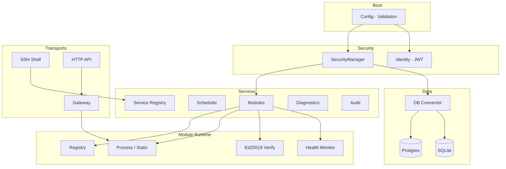
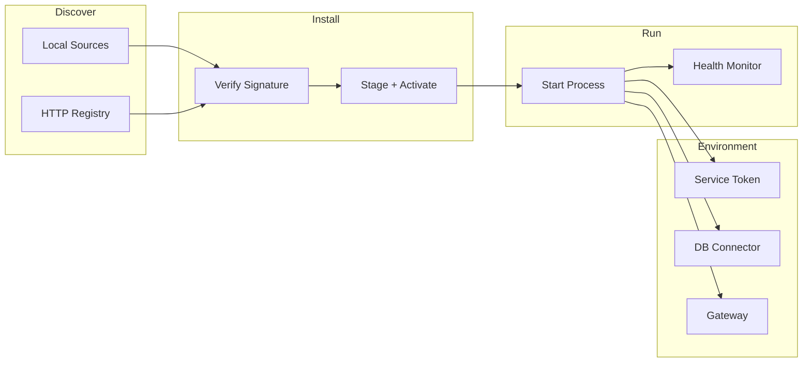
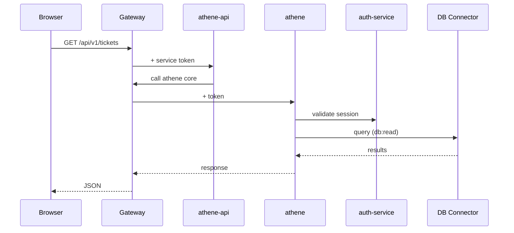
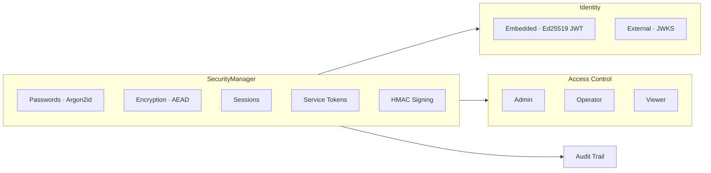
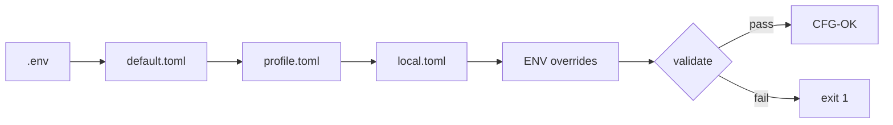
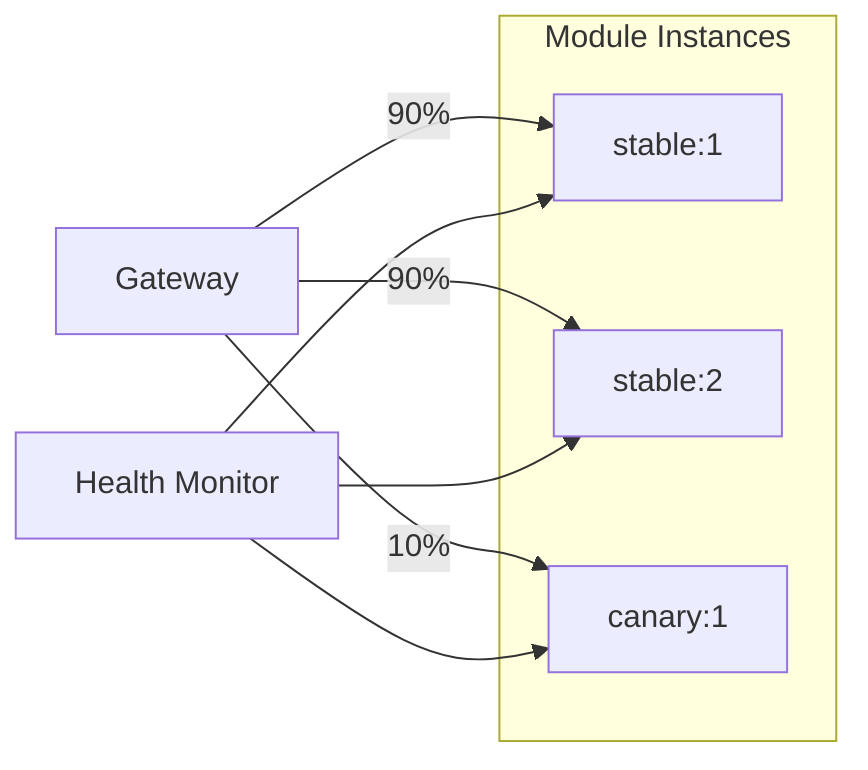
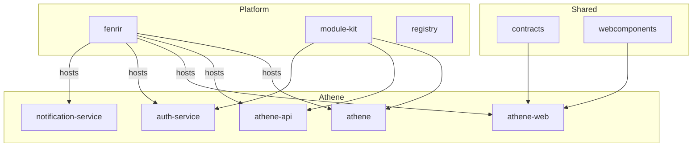

<p align="center">
  <strong>FENRIR</strong>
</p>

<p align="center">
  A modular Rust monolith with built-in SSH shell, HTTP control plane,<br>
  plugin architecture, and multi-database support.
</p>

<p align="center">
  
  
  
  
  
</p>

---

Fenrir is a **security-first application server** written in Rust. It provides its own interactive shell over SSH, an HTTP control plane with a service gateway, a dynamic module/plugin runtime, and multi-engine database support — all in a single binary.

Operators connect via SSH and manage the system through a custom CLI. Modules (microservices) are installed from a registry, verified with Ed25519 signatures, and orchestrated by Fenrir's runtime — including health monitoring, automatic token rotation, and inter-module communication through a built-in gateway.

The project serves as the backend platform for [Athene](#module-ecosystem--athene), a ticket and project management system built as a suite of independently deployable modules.

> **Solo project** — designed, architected, and implemented independently as a learning exercise in systems programming. The full ecosystem spans **~68,000 lines of Rust** in Fenrir alone, **1,500+ source files** across 10+ repositories (Rust, TypeScript, Angular), and covers everything from cryptographic primitives to Angular component libraries.

---

## Architecture



---

## Key Features

### SSH Server with Interactive Shell
A custom terminal emulator built on [russh](https://github.com/warp-tech/russh). No OS PTY — Fenrir implements its own line editor, history, tab completion, and ANSI rendering directly on the SSH channel. Operators get a full interactive shell over a standard `ssh` connection.

### HTTP Control Plane & Service Gateway
An [Axum](https://github.com/tokio-rs/axum)-based HTTP server with 40+ endpoints for module management, service lifecycle, metrics, audit history, and real-time SSE event streams. The built-in gateway proxies requests to module services with automatic token injection, RBAC enforcement, rate limiting, and route-prefix deduplication.

### Dynamic CLI with 27+ Commands
A verb-first command system with tab completion, contextual subcommands, and alias support. Commands like `start module athene`, `status service db-shell`, or `log job token-lease-monitor --tail 50` work naturally. New commands register as folders under `cli/commands/builtins/`.

### Integrated Database Shell
A dedicated `db:` subshell with SQL auto-completion (tables, columns, keywords), multi-engine switching (`\c postgres`, `\c sqlite`), schema introspection (`\d`, `\d users`), and destructive command guards — `DROP`, `DELETE`, `ALTER`, and `TRUNCATE` require an explicit `--force` suffix.

### Module & Plugin System
Modules are installed from a composite registry (offline-first, then HTTP), verified with Ed25519 signatures, and spawned as isolated processes or embedded static-site servers. Each module receives scoped service tokens, a DB connector endpoint, and a per-module gateway — never raw credentials. Modules scale horizontally with configurable replicas, rolling restarts with surge replacement for zero-downtime updates, and canary deployments with automatic traffic shifting and health-based rollback. Failed modules are automatically quarantined after 3 crashes within 120 seconds.

### Security Architecture
All cryptographic operations go through a single `SecurityManager` facade — Argon2id password hashing, AES-256-GCM / XChaCha20-Poly1305 encryption, HMAC-SHA256 manifest signing, RBAC sessions, and delegated service tokens with grace-period refresh. The identity system supports both an embedded Ed25519 JWT authority and external identity brokers with JWKS verification.

### Multi-Database Support
Postgres and SQLite adapters behind a unified `DbAdminPort` trait. Fenrir can run an embedded database (spawns its own Postgres or SQLite instance) or connect to external servers. Modules access the database exclusively through a token-gated JSON connector — no direct DB credentials ever leave the host process.

### Observability & Audit
Per-service diagnostics with P50/P95 latency and error rates, process-level CPU/memory/IO metrics, a 7-job scheduler (health scans, token lease monitoring, audit draining), structured logging with rotation, and a full audit trail covering every security event, module lifecycle action, and operator command.

---

## Design Decisions

These are deliberate architectural choices, not defaults. Each one solves a specific problem.

**Why a custom terminal emulator instead of OS PTY?**
A traditional PTY delegates rendering and input to the host OS, which means shell escapes, uncontrolled subprocesses, and platform-dependent behavior. Fenrir's SSH channel implements its own line editor, history, completion, and ANSI rendering — so the server controls exactly what operators can do. No shell injection, no `os.system()`, no surprises.

**Why service tokens instead of shared DB credentials?**
Modules never see a database URI. Instead, each module gets a short-lived, scoped service token (default scope: `db:read`) that grants access through a JSON connector. Write operations require explicit `db:write` scope. Tokens auto-rotate, expire after 15 minutes, and every query is auditable back to the issuing module. Compromising one module doesn't compromise the database.

**Why a SecurityManager facade instead of direct crypto calls?**
Every cryptographic operation — password hashing, encryption, session management, token issuance, RBAC checks — goes through a single `SecurityManager`. This makes it impossible to accidentally use raw primitives without audit logging, and ensures algorithm choices (Argon2id params, allowed ciphers) are enforced from one place. New features can't bypass the security layer.

**Why composite registry with offline-first resolution?**
During development, modules are resolved from local directories before falling back to the HTTP registry. This means you can work without network access, iterate on module code without publishing, and the registry is a deployment concern — not a development bottleneck.

**Why `unwrap`, `expect`, and `panic` are denied by clippy?**
Fenrir runs as a long-lived server managing other processes. A panic in production kills the host and every module with it. By denying these at the lint level (`clippy::unwrap_used`, `clippy::expect_used`, `clippy::panic`), every error path must be explicitly handled. The codebase uses `Result` and `Option` propagation throughout — no shortcuts.

**Why ports and adapters instead of direct DB access?**
Services depend on `DbAdminPort` (a trait), not on `tokio-postgres` or `rusqlite`. Swapping the database engine is a config change, not a refactor. The same pattern applies to module registries, storage backends, and identity providers. Tests use in-memory implementations without touching real infrastructure.

---

## Tech Stack

| Category | Crates / Tools |
|----------|---------------|
| **Runtime** | `tokio` (multi-thread), `futures`, `async-trait` |
| **HTTP** | `axum`, `hyper`, `tower`, `tower-http`, `reqwest` |
| **SSH** | `russh`, `russh-keys` |
| **CLI** | `rustyline`, `clap` (derive) |
| **Crypto** | `argon2`, `aes-gcm`, `chacha20poly1305`, `ed25519-dalek`, `sha2`, `hmac`, `rand` |
| **Database** | `tokio-postgres`, `rusqlite` (bundled) |
| **TLS** | `rustls`, `tokio-rustls` |
| **Serialization** | `serde`, `serde_json`, `toml` |
| **Observability** | `tracing`, `tracing-subscriber`, `sysinfo` |
| **Packaging** | `semver`, `tar`, `flate2` |
| **Quality** | clippy `pedantic` + `nursery`, deny `unwrap_used` / `expect_used` / `panic` / `todo` |

**332 Rust source files** &middot; **~68,000 lines** &middot; **50+ dependencies** &middot; **Rust 2021 edition** &middot; Release: `lto = true`, `codegen-units = 1`

---

## Getting Started

### Prerequisites

- Rust toolchain (stable, 2021 edition)
- PostgreSQL 14+ or SQLite (optional — Fenrir can run an embedded instance)

### Configuration

Fenrir loads configuration through a layered chain with fail-fast validation:

```
secrets/.env          environment secrets (FENRIR_SSH_PASSWORD, DB URIs, tokens)
       ↓
config/default.toml   base defaults
       ↓
config/<profile>.toml profile overlay (via FENRIR_ENV=dev|prod)
       ↓
config/local.toml     machine-specific overrides (git-ignored)
       ↓
FENRIR_CONFIG_FILE    explicit override path
       ↓
FENRIR__*             environment variable overrides (double underscore = nesting)
```

Validate before running:

```sh
cargo run -- --check-config
# CFG-OK  configuration valid
```

### Run

```sh
# Start the server (SSH + HTTP + modules)
cargo run

# Or start with interactive CLI shell
cargo run -- --cli

# Apply database migrations only
cargo run -- --migrate
```

### Connect via SSH

```sh
ssh admin@localhost -p 2222
```

### fenrirctl — Headless Control

`fenrirctl` is a separate binary for scripted control plane access — no SSH session required:

```sh
fenrirctl status                    # Show installed modules
fenrirctl shutdown                  # Release overrides → stop modules → stop services
fenrirctl release-dev-overrides     # Revert all dev syncs to distribution artifacts
fenrirctl stop-modules              # Stop all running module processes
fenrirctl db-runtime-status         # Embedded database runtime health
fenrirctl db-runtime-logs --tail 50 # Recent database runtime output
```

Tokens are resolved from `FENRIR_CONTROL_TOKEN` or `FENRIR_HTTP_TOKEN_ADMIN` automatically. Useful for CI pipelines, service managers, and shutdown scripts.

---

## CLI

### Shell Session

When you connect via SSH or start with `--cli`, Fenrir presents an interactive shell:

```
  ╭────────────────────────────────────────────────────╮
  │                                                    │
  │   FENRIR › fenrir-server                           │
  │                                                    │
  ├────────────────────────────────────────────────────┤
  │   version   0.1.4          profile   dev           │
  │   user      admin          role      Admin         │
  │                                                    │
  ╰────────────────────────────────────────────────────╯

▸ fenrir · fenrir-server · 0.1.4
  type help for available commands

[Admin::local] admin@hostname fenrir »
```

### Command Reference

| Command | Description |
|---------|-------------|
| `help` | List all commands or get details on a specific command |
| `list services` | Show all registered services with status |
| `list modules` | Show installed modules with runtime info (PID, port, uptime) |
| `list jobs` | Show scheduler jobs with intervals and status |
| `status fenrir` | System overview (version, uptime, services, modules) |
| `status service <id>` | Diagnostics for a service (P50/P95 latency, error rate) |
| `status job <id>` | Scheduler job snapshot |
| `start\|stop\|restart module <id>` | Module lifecycle control |
| `start\|stop\|restart service <id>` | Service lifecycle control (with `--force` for critical) |
| `pause\|resume job <id>` | Scheduler job control |
| `search modules [pattern]` | Search the module registry |
| `install distribution` | Plan and install module updates from the registry |
| `synchronize module <id>` | Sync a module from local dev sources |
| `release module <id>` | Revert a dev override to the distribution artifact |
| `modules instances <id>` | List running instances with PID, port, and health |
| `modules rolling-restart <id>` | Zero-downtime restart with surge replacement |
| `modules canary start\|set\|clear <id>` | Canary traffic routing (gradual rollout) |
| `scaffold module <id>` | Generate a module skeleton (`--runtime rust\|node\|angular`) |
| `log module <id>` | Stream module runtime logs |
| `log job <id> --tail 50` | Filter app log for a scheduler job |
| `log level debug` | Change tracing level at runtime |
| `audit --limit 50` | Recent audit events (filterable by action, outcome, actor) |
| `user list` | List identity users |
| `user password set <id>` | Admin password reset (Argon2, policy enforced) |
| `export schema` | Export database schema to StarUML format |
| `backup db` | Create a database backup |
| `db-shell` | Enter the interactive database shell |
| `clear` | Clear the terminal |
| `exit` | Disconnect |

### Database Shell

Enter with `db-shell`. The prompt changes to reflect the active mode:

```
[Admin::local] admin@hostname fenrir » db-shell

[Admin::local] admin@hostname db fenrir » \d
 Tables in database:
 ─────────────────────
  users
  sessions
  verification_codes
  feature_flags
  ...

[Admin::local] admin@hostname db fenrir » \d users
 Column          | Type      | Nullable
 ────────────────┼───────────┼──────────
  id             | uuid      | NO
  email          | varchar   | NO
  password_hash  | text      | YES
  role           | varchar   | NO
  created_at     | timestamp | NO

[Admin::local] admin@hostname db fenrir » SELECT * FROM users;
 ...

[Admin::local] admin@hostname db fenrir » DROP TABLE users;
 ⚠ Destructive commands require '--force' at the end of the line.

[Admin::local] admin@hostname db fenrir » DROP TABLE users; --force
 Table dropped.

[Admin::local] admin@hostname db fenrir » \c sqlite
 Switched to sqlite. Pinging... OK

[Admin::local] admin@hostname db fenrir » exit
```

**Features:**
- Multi-line SQL (continues until `;`)
- Tab completion for table names, columns, and SQL keywords
- `\c <engine>` to switch between Postgres and SQLite
- `\d` / `\d <table>` for schema introspection
- `\ping` to test the connection
- Destructive guard: `DROP`, `DELETE`, `ALTER`, `TRUNCATE` blocked without `--force`

---

## Module Ecosystem & Athene

Fenrir manages modules through a full lifecycle: discovery, installation, signature verification, process management, health monitoring, and inter-module communication.



### Athene — Ticket & Project Management

The primary application built on Fenrir is **Athene**, a modular ticket and project management platform:

| Module | Stack | Role |
|--------|-------|------|
| **athene** | Rust / Axum | Core domain — tickets, projects, workspaces, sprints, labels, custom fields, SLAs, activity feeds, admin |
| **athene-api** | Rust / Axum | Public API gateway (BFF) — typed proxy with rate limiting, circuit breaker, OpenAPI/Swagger |
| **athene-web** | Angular 18 | SPA frontend — standalone components, signals, i18n, gridster dashboards, command palette |
| **athene-webcomponents** | Angular 18 | Shared design system (`@athene/webcomponents`) — 40+ components, Storybook, npm-published |
| **athene-contracts** | Rust + TypeScript | Shared API contracts — dual-stack DTOs with validation, typed HTTP clients |
| **auth-service** | Rust / Axum | Authentication — challenge/PIN login, sessions, password reset, optional OIDC, Argon2 |
| **notification-service** | Rust / Axum | Email delivery — Tera templates, SMTP via Lettre, queue management |

**Planned modules** (reserved, not yet implemented):

| Module | Purpose |
|--------|---------|
| analytics-service | Usage analytics and reporting |
| calendar-service | Calendar and scheduling |
| file-service | File attachments and storage |
| search-service | Full-text search indexing |
| time-tracking-service | Time tracking per ticket/project |
| webhook-service | Outbound webhook delivery |
| wiki-service | Knowledge base and documentation |

### Module Communication

Modules never hold database credentials or call each other directly. All communication flows through Fenrir:



### Environment Injection

Every module process receives a curated set of `FENRIR_*` variables — never raw host secrets:

| Variable | Purpose |
|----------|---------|
| `FENRIR_MODULE_ID` | Module identifier |
| `FENRIR_SERVICE_TOKEN` | Short-lived scoped token (auto-refreshed) |
| `FENRIR_SERVICE_TOKEN_TTL_SECS` | Remaining token lifetime |
| `FENRIR_GATEWAY_ENDPOINT` | Per-module HTTP gateway for service-to-service calls |
| `FENRIR_CONTROL_PLANE_URL` | Host control plane base URL |
| `FENRIR_DB_CONNECTOR_ENDPOINT` | Token-gated database access endpoint |
| `FENRIR_SERVICE_PORT` | Assigned port (dynamic allocation from configured range) |
| `FENRIR_SERVICE_SNAPSHOT_PATH` | Path to consolidated service registry snapshot |

### Dev Workflow

Fenrir supports a seamless local development loop. Instead of publishing module artifacts to a registry during development, you work directly from your local source tree:

```
[Admin::local] admin@hostname fenrir » synchronize module athene
  ▸ Backing up current distribution artifact...
  ▸ Packaging dev build from /opt/fenrir/development/modules/athene
  ▸ Registering dev services: module:athene::core
  ▸ Injecting service tokens + gateway endpoint
  ▸ Module synchronized (dev override active)

[Admin::local] admin@hostname fenrir » release module athene
  ▸ Restoring distribution artifact from backup
  ▸ Dev override released
```

**What happens during `sync module`:**
1. The current distribution artifact is backed up (tarball under `.fenrir-backups/`)
2. The local dev build is packaged and activated
3. Dev service endpoints from `.fenrir-dev.toml` or `.fenrir/config.toml` are registered
4. Fenrir injects `FENRIR_*` environment, service tokens, and gateway endpoint
5. Optional: a dev agent starts the module's dev command (e.g., `cargo run`) with full infrastructure access

**What `release module` does:**
1. Stops any dev agent / dev process
2. Restores the backed-up distribution artifact
3. Cleans up dev environment files (`.fenrir/dev.env`, export scripts)
4. Falls back to registry install if backup is corrupted

The developer gets full access to Fenrir's infrastructure (DB connector, auth, gateway, other modules) while working from their IDE. No manual token management, no port configuration, no mock services.

---

## Security



| Layer | Implementation |
|-------|---------------|
| **KDF** | Argon2id (64 MiB memory, 3 iterations, 2 parallelism) |
| **AEAD** | AES-256-GCM (12B nonce) and XChaCha20-Poly1305 (24B nonce) |
| **Passwords** | Argon2id PHC strings, configurable policy (12+ chars, upper/lower/digit in prod) |
| **Sessions** | 32-byte opaque tokens, 1h lifetime, 15min idle timeout, periodic cleanup |
| **Service Tokens** | 32-byte tokens with claims (actor, tenant, scopes), 15min lifetime, 1h grace-period refresh |
| **Module Signatures** | Ed25519 over SHA-256 artifact checksums, keyring-based allowlist |
| **Manifest Signing** | HMAC-SHA256 over canonical JSON, keyed by service token, constant-time verify |
| **Identity** | Embedded (Ed25519 JWT, local store) or external (HTTP broker, JWKS, optional mTLS) |
| **RBAC** | Hierarchical: Admin > Operator > Viewer. Service roles: Admin > Write > Read |
| **Audit** | Every session, token, RBAC decision, module action, and operator command is recorded |

---

## Project Structure

```
src/
├── main.rs                         # Entry point, CLI flags (--check-config, --migrate, --cli)
├── lib.rs                          # 14 top-level modules
├── bin/
│   ├── fenrirctl.rs                # HTTP client for control plane automation
│   └── fenrir-module-kit.rs        # Module bootstrap helper (init --module-root)
│
├── boot/                           # Fail-fast startup, service wiring, transport init
├── config/                         # TOML loader, typed schema, validation (CFG-* codes)
│
├── domain/                         # Pure business logic — no IO dependencies
│   ├── db/                         #   Engine enum, DbAdminPort trait, value types
│   └── module/                     #   Manifests, bundles, ports, runtime types
│
├── security/                       # SecurityManager facade
│   ├── auth/                       #   RBAC roles, password policy, HTTP auth
│   ├── crypto/                     #   AEAD registry, Argon2 KDF
│   ├── identity/                   #   Embedded JWT authority, external broker, stores
│   └── session/                    #   Session store, types, errors
│
├── services/                       # Use-case orchestration
│   ├── module/                     #   Install, sync, lifecycle, gateway, dev workflow
│   ├── scheduler/                  #   Background job engine with pause/resume
│   ├── db_shell/                   #   Multi-engine DB admin facade
│   ├── db_connector/               #   Token-gated JSON protocol for modules
│   ├── backup/                     #   Database backup and restore
│   ├── security/                   #   Session service, instrumented identity
│   ├── diagnostics.rs              #   Per-service P50/P95/error rate tracking
│   ├── registry.rs                 #   Service catalog with broadcast
│   ├── public_status.rs            #   Public incident/component tracking
│   └── token_exchange.rs           #   Service token issuance for modules
│
├── infra/                          # Port implementations
│   ├── db/
│   │   ├── adapters/               #   postgres/, sqlite/
│   │   ├── migrations/             #   Runner, planner, per-engine SQL files
│   │   ├── runtime/                #   Embedded DB supervisor (Postgres/SQLite)
│   │   └── connector.rs            #   IPC/TCP JSON protocol server
│   ├── http/                       #   Axum router, gateway proxy, TLS, SSE
│   ├── ssh/                        #   russh server, custom terminal, session writer
│   ├── modules/
│   │   ├── registry.rs             #   Composite (offline + HTTP) module registry
│   │   ├── runtime/                #   Process spawner, static site server, in-process stub
│   │   ├── storage.rs              #   Filesystem artifact store
│   │   └── verifier.rs             #   Ed25519 signature verification
│   ├── logging/                    #   tracing init, file rotation, DB log
│   └── telemetry/                  #   Metrics, health probes, system sampler
│
├── cli/
│   ├── commands/builtins/          #   27+ command implementations (one folder each)
│   ├── completion.rs               #   Context-aware tab completion engine
│   ├── shell/                      #   REPL runner, history, outcome handling
│   ├── sql_completion/             #   SQL-aware completion (tables, columns, keywords)
│   └── output/                     #   Status boxes, tables, styled rendering
│
├── audit/                          # Event model, in-memory log, JSON persistence
├── prompts/                        # Shell prompt builder, theme, banner
├── protocol/                       # Wire protocol (frames, codec, versioning)
├── session/                        # Domain session models
├── dev_agent/                      # Dev-mode module supervisor
├── prelude/                        # Re-exports (anyhow, tracing)
└── utils/                          # Duration formatting, message templates
```

**332 Rust source files** across 14 top-level modules.

---

## Configuration

### Config Chain



### Key Sections

| Section | Fields |
|---------|--------|
| `app` | name, version, distribution, profile |
| `server` | enable_http, enable_grpc |
| `server.ssh` | host, port, user, host_key_path, idle_close_seconds |
| `server.http` | host, port, TLS (cert, key, CA, auto-reload) |
| `security` | allowed_ciphers, KDF params, JWT, session, service_tokens, password_policy |
| `security.identity` | provider (embedded/external), environment, store path, JWKS, mTLS |
| `db` | default_engine, connections (postgres/sqlite), runtime mode (embedded/external) |
| `db.runtime.embedded` | engine, data_dir, port_range, auth_method, unix socket |
| `telemetry` | tracing level, metrics, health, system sampler interval, history retention |
| `audit` | buffer_capacity, storage path, retention, persist interval |
| `modules.registry` | URL, offline_dirs, TLS, auth token |
| `modules.runtime` | engine (process/stub), port range, health probe interval, rollout strategy |
| `modules.trust` | require_signature, keyring_path, allowed_signers |
| `modules.services.*` | Per-module env, secrets, policy overrides, profiles |

### Validation Codes

| Code | Meaning |
|------|---------|
| `CFG-OK` | Configuration valid |
| `CFG-MISSING-SECRET` | Required secret/ENV variable not set |
| `CFG-INVALID` | Schema violation (e.g., prod identity without HTTPS) |
| `CFG-MISSING-FILE` | Referenced file does not exist |
| `CFG-INVALID-PROFILE` | Unknown profile name |
| `CFG-DESERIALIZE` | TOML parsing or type error |

---

## HTTP Control Plane

### Route Overview

| Group | Method | Path | Auth |
|-------|--------|------|------|
| **Health** | GET | `/health/live` | None |
| | GET | `/health/ready` | None |
| **Public** | GET | `/public/status` | None |
| **Info** | GET | `/info` | Viewer |
| **Services** | GET | `/services` | Viewer |
| | GET | `/services/:id/runtime-metrics` | Viewer |
| | POST | `/services/:id/{start\|stop\|restart}` | Operator |
| | POST | `/services/actions/{start-all\|stop-all\|restart-all}` | Operator |
| **Modules** | GET | `/modules/installed` | Viewer |
| | GET | `/modules/available` | Viewer |
| | POST | `/modules/install` | Operator |
| | POST | `/modules/update` | Operator |
| | DELETE | `/modules/:id` | Operator |
| | POST | `/modules/runtime/:id/{start\|stop\|restart}` | Operator |
| | POST | `/modules/runtime/:id/rolling-restart` | Operator |
| | GET | `/modules/runtime/:id/instances` | Viewer |
| | POST | `/modules/runtime/stop-all` | Operator |
| | POST | `/modules/runtime/release-dev-overrides` | Operator |
| | POST | `/modules/runtime/services` | Service Token |
| | POST | `/modules/runtime/tokens` | Service Token |
| **Gateway** | ANY | `/gateway/services/:service_id/*` | Service Token / Public |
| | ANY | `/gateway/grpc/:service_id/*` | Service Token |
| **Observability** | GET | `/metrics` | Viewer |
| | GET | `/metrics/history` | Viewer |
| | GET | `/audit` | Viewer |
| | GET | `/audit/history` | Viewer |
| | GET | `/events/stream` | Viewer (SSE) |
| **Identity** | GET | `/identity/users` | Admin |
| | POST | `/identity/tokens` | Admin |
| **Ops** | POST | `/logging/level` | Operator |
| | GET | `/scheduler/jobs` | Viewer |

### Public Status API

`GET /public/status` returns a sanitized view for external status pages — no internal service IDs, no security details:

```json
{
  "overall": "operational",
  "live": true,
  "ready": true,
  "updated_at": "2026-04-15T13:22:00Z",
  "components": [
    { "name": "website", "status": "operational" },
    { "name": "api", "status": "operational" },
    { "name": "account", "status": "operational" }
  ],
  "incidents": []
}
```

---

## Scheduler

Fenrir runs 7 background jobs with configurable intervals, pause/resume support, and state persistence:

| Job | Interval | Purpose |
|-----|----------|---------|
| `telemetry-health-refresh` | 60s | Read system metrics, update scheduler status |
| `service-health-scan` | 30s | Count failed/degraded services, update registry |
| `db-default-ping` | 120s | Ping default database, set db-shell status |
| `token-lease-monitor` | 60s | Refresh module tokens with TTL below 180s |
| `module-heartbeat-verifier` | 45s | Probe module health endpoints, update status |
| `audit-drain` | 300s | Snapshot recent audit events to `runtime/audit/drain/` |
| `db-auto-backup` | configurable | Automated database backups (when backup service enabled) |

Each job records latency probes in `ServiceDiagnostics` and is controllable via CLI (`pause job <id>`, `resume job <id>`, `restart job <id>`).

---

## Runtime Operations

Fenrir is designed to run as a long-lived process managing other processes. These features reflect that:

**Config hot-reload** — On Unix, `SIGHUP` triggers a config reload. On all platforms, Fenrir watches `config/`, `secrets/`, and profile files for changes (debounced). Reloads update log levels, TLS certificates, and module service overrides without restarting.

**TLS certificate rotation** — When TLS is enabled, Fenrir detects certificate file changes and reloads them live. No downtime, no restart, no dropped connections.

**Module quarantine** — If a module crashes 3 times within 120 seconds, it is automatically quarantined for 5 minutes. The service registry is annotated with "quarantined until ..." and start/ensure calls are blocked. This prevents crash loops from consuming resources.

**Rolling restarts** — `POST /modules/runtime/:id/rolling-restart` or CLI `modules rolling-restart <id>` performs health-gated instance restarts with surge replacement. New instances must pass health probes before old ones are drained. See [Scaling & Traffic Management](#scaling--traffic-management) for details on replicas, canary deployments, and rollout strategies.

**"Did you mean?" corrections** — Typos in the CLI trigger Levenshtein-distance suggestions: `strt module athene` → "Did you mean: start?" Up to 3 suggestions, computed across all registered commands and aliases.

**Graceful shutdown** — `fenrirctl shutdown` executes a clean sequence: release dev overrides → stop all modules → stop non-core services. Also available via SSH: `stop module --all` followed by `exit`.

---

## Scaling & Traffic Management

Fenrir can run multiple instances of any module, shift traffic between them, and roll out new versions without dropping a single request.



### Replicas

Each module can declare a desired replica count in config or via service profiles. Fenrir reconciles instances automatically — spawning additional processes on separate ports and registering them with the service registry. The gateway load-balances across all healthy instances.

```toml
# config/local.toml
[modules.services."module:athene::core"]
replicas = 3
```

When the replica count changes (via `reload-overrides` or config hot-reload), Fenrir reconciles live — spinning up or draining instances without a full restart.

### Rolling Restarts with Surge Replacement

`modules rolling-restart <id>` (or `POST /modules/runtime/:id/rolling-restart`) restarts instances one at a time while maintaining capacity:

1. **Surge** — a new instance is spawned (desired + 1), bringing temporary overcapacity
2. **Health gate** — the new instance must pass readiness probes before continuing
3. **Drain** — the old instance is marked unhealthy, drained, and restarted
4. **Verify** — the restarted instance passes health checks before moving to the next
5. **Settle** — once all instances are replaced, the surge instance is removed

With `replicas >= 2`, this achieves **zero-downtime restarts**. Single-instance modules fall back to a simple restart with a brief interruption.

### Canary Deployments

Canary routing gradually shifts traffic from stable instances to candidate instances, with automatic promotion or rollback based on real-time health metrics:

```
[Admin::local] admin@hostname fenrir » modules canary start athene
  ▸ Canary routing started: 10% traffic → canary instances

[Admin::local] admin@hostname fenrir » modules canary set athene 50
  ▸ Canary traffic updated: 50%

[Admin::local] admin@hostname fenrir » modules canary clear athene
  ▸ Canary routing cleared, all traffic restored to stable instances
```

**Automatic promotion** — when configured with `canary_replace` strategy, Fenrir evaluates success criteria on every health cycle and promotes traffic in steps (default: 10% → 25% → 50% → 100%):

| Criterion | Config Key | Effect |
|-----------|-----------|--------|
| Error rate | `max_error_rate_percent` | Rolls back if error rate exceeds threshold |
| P95 latency | `max_p95_latency_ms` | Rolls back if latency degrades |
| Retry rate | `max_retry_rate_percent` | Rolls back if upstream retries spike |
| Queue backlog | `max_queue_backlog` | Rolls back if work queue grows |

```toml
# config/local.toml
[modules.services."module:athene::core".rollout]
strategy = "canary_replace"
traffic_steps = [10, 25, 50, 100]
promotion_interval_ms = 30000
rollback_on_regression = true

[modules.services."module:athene::core".rollout.success_criteria]
max_error_rate_percent = 5
max_p95_latency_ms = 200
```

If any criterion regresses during a canary window, Fenrir automatically rolls traffic back to stable instances and marks the service as `Degraded` — no manual intervention required.

### Rollout Strategies

| Strategy | Behavior |
|----------|----------|
| `restart` | Simple stop → start (default) |
| `rolling_replace` | Surge-replace instances one at a time, health-gated |
| `canary_replace` | Gradual traffic shift with automatic promotion/rollback |
| `worker_handover` | Graceful handover for long-running worker processes |

---

## Wire Protocol

Fenrir defines a versioned JSON wire protocol (`src/protocol/`) for programmatic clients beyond interactive SSH:

| Direction | Messages |
|-----------|----------|
| **Client → Server** | `Hello` (client_id, hostname), `Command` (command, args), `Complete` (line, cursor), `Exit` |
| **Server → Client** | `Welcome` (banner, motd), `Prompt` (prompt string), `Output` (status, lines), `Error` (code, message), `Goodbye` (reason) |

Every frame is version-tagged (currently v1). The codec rejects version mismatches on decode — forward-compatible by design. This protocol enables future IDE integrations, CI tooling, and remote management clients without relying on SSH terminal scraping.

---

## Testing

```
tests/
├── unit/               17 test suites via #[path] includes
│   ├── security/       SecurityManager, service tokens, KDF, AEAD, sessions
│   ├── cli/            Tab completion, db-shell guards
│   ├── config/         Config validation
│   ├── services/       Registry, types, scheduler, module ports
│   ├── infra/          Telemetry, module runtime (process + in-process)
│   └── boot/           Bootstrap
├── integration/        Config loading, DB runtime, schema operations
└── e2e/                CLI + DB runtime end-to-end flows
```

### CI Pipeline

```yaml
# .github/workflows/ci.yml
jobs:
  lint:    cargo fmt --check && cargo clippy -- -D warnings
  test:    cargo test --workspace --all-features
  package: cargo build --release → tarball (fenrir + config/)
```

---

## Ecosystem



| Repository | Stack | Role |
|------------|-------|------|
| [fenrir](.) | Rust | Application server — SSH, HTTP, modules, security, DB |
| [fenrir-module-kit](../module-kit) | Rust | Module SDK — env parsing, DB connector, token provider, gateway client |
| [fenrir-registry](../fenrir-registry) | Rust | Lightweight module registry with webhook support |
| [fenrir-registry-service](../fenrir-registry-service) | Rust | Production registry — GitHub App, SQLite cache, SSE, RBAC |
| [athene](../modules/athene) | Rust / Axum | Core domain — tickets, projects, workspaces, sprints, custom fields |
| [athene-api](../modules/athene-api) | Rust / Axum | Public API gateway — typed proxy, circuit breaker, OpenAPI |
| [athene-web](../modules/athene-web) | Angular 18 | SPA frontend — signals, i18n, dashboards, command palette |
| [athene-webcomponents](../modules/athene-webcomponents) | Angular 18 | Design system — 40+ components, Storybook |
| [athene-contracts](../athene-contracts) | Rust + TypeScript | Shared API contracts — dual-stack DTOs with validation |
| [auth-service](../modules/auth-service) | Rust / Axum | Authentication — PIN login, OIDC, Argon2, sessions |
| [notification-service](../modules/notification-service) | Rust / Axum | Email delivery — Tera templates, SMTP, queues |

---

<p align="center">
  <sub>Solo project &middot; Active development &middot; v0.1.4 &middot; Built with Rust</sub>
</p>
