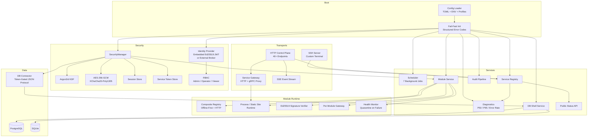
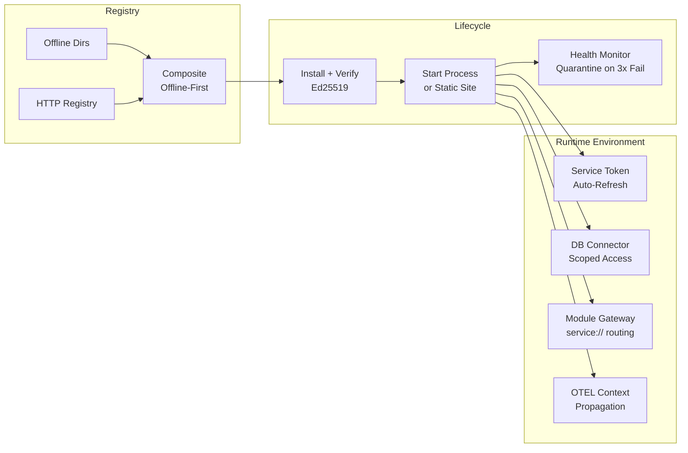
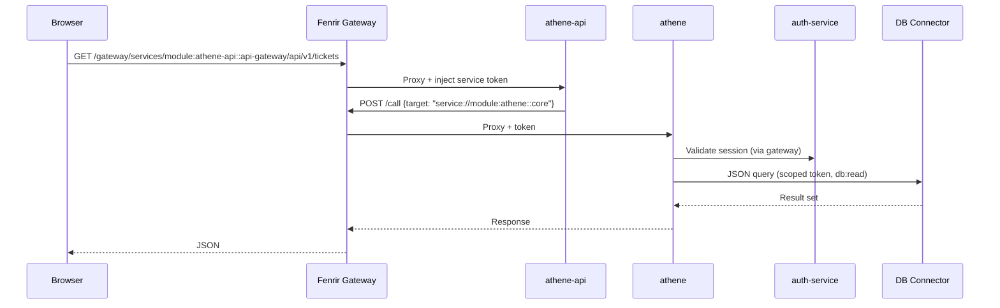
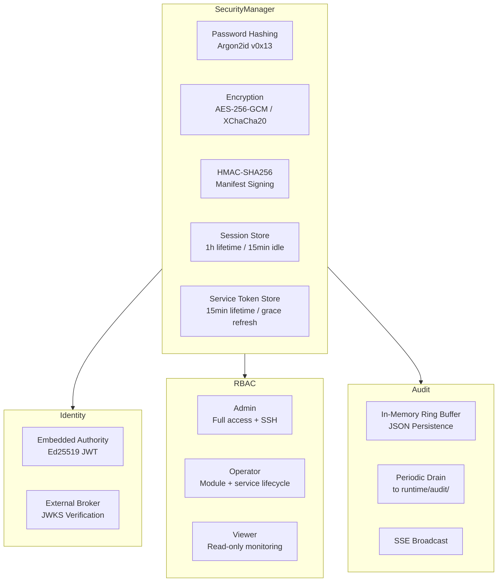
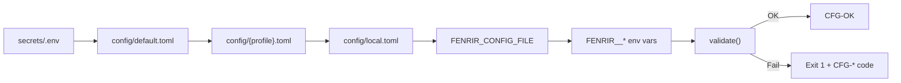

<p align="center">
  <strong>FENRIR</strong>
</p>

<p align="center">
  A modular Rust monolith with built-in SSH shell, HTTP control plane,<br>
  plugin architecture, and multi-database support.
</p>

<p align="center">
  
  
  
  
  
</p>

---

Fenrir is a **security-first application server** written in Rust. It provides its own interactive shell over SSH, an HTTP control plane with a service gateway, a dynamic module/plugin runtime, and multi-engine database support — all in a single binary.

Operators connect via SSH and manage the system through a custom CLI. Modules (microservices) are installed from a registry, verified with Ed25519 signatures, and orchestrated by Fenrir's runtime — including health monitoring, automatic token rotation, and inter-module communication through a built-in gateway.

The project serves as the backend platform for [Athene](#module-ecosystem--athene), a ticket and project management system built as a suite of independently deployable modules.

---

## Architecture



---

## Key Features

### SSH Server with Interactive Shell
A custom terminal emulator built on [russh](https://github.com/warp-tech/russh). No OS PTY — Fenrir implements its own line editor, history, tab completion, and ANSI rendering directly on the SSH channel. Operators get a full interactive shell over a standard `ssh` connection.

### HTTP Control Plane & Service Gateway
An [Axum](https://github.com/tokio-rs/axum)-based HTTP server with 40+ endpoints for module management, service lifecycle, metrics, audit history, and real-time SSE event streams. The built-in gateway proxies requests to module services with automatic token injection, RBAC enforcement, rate limiting, and route-prefix deduplication.

### Dynamic CLI with 27+ Commands
A verb-first command system with tab completion, contextual subcommands, and alias support. Commands like `start module athene`, `status service db-shell`, or `log job token-lease-monitor --tail 50` work naturally. New commands register as folders under `cli/commands/builtins/`.

### Integrated Database Shell
A dedicated `db:` subshell with SQL auto-completion (tables, columns, keywords), multi-engine switching (`\c postgres`, `\c sqlite`), schema introspection (`\d`, `\d users`), and destructive command guards — `DROP`, `DELETE`, `ALTER`, and `TRUNCATE` require an explicit `--force` suffix.

### Module & Plugin System
Modules are installed from a composite registry (offline-first, then HTTP), verified with Ed25519 signatures, and spawned as isolated processes or embedded static-site servers. Each module receives scoped service tokens, a DB connector endpoint, and a per-module gateway — never raw credentials. Failed modules are automatically quarantined after 3 crashes within 120 seconds.

### Security Architecture
All cryptographic operations go through a single `SecurityManager` facade — Argon2id password hashing, AES-256-GCM / XChaCha20-Poly1305 encryption, HMAC-SHA256 manifest signing, RBAC sessions, and delegated service tokens with grace-period refresh. The identity system supports both an embedded Ed25519 JWT authority and external identity brokers with JWKS verification.

### Multi-Database Support
Postgres and SQLite adapters behind a unified `DbAdminPort` trait. Fenrir can run an embedded database (spawns its own Postgres or SQLite instance) or connect to external servers. Modules access the database exclusively through a token-gated JSON connector — no direct DB credentials ever leave the host process.

### Observability & Audit
Per-service diagnostics with P50/P95 latency and error rates, process-level CPU/memory/IO metrics, a 7-job scheduler (health scans, token lease monitoring, audit draining), structured logging with rotation, and a full audit trail covering every security event, module lifecycle action, and operator command.

---

## Tech Stack

| Category | Crates / Tools |
|----------|---------------|
| **Runtime** | `tokio` (multi-thread), `futures`, `async-trait` |
| **HTTP** | `axum`, `hyper`, `tower`, `tower-http`, `reqwest` |
| **SSH** | `russh`, `russh-keys` |
| **CLI** | `rustyline`, `clap` (derive) |
| **Crypto** | `argon2`, `aes-gcm`, `chacha20poly1305`, `ed25519-dalek`, `sha2`, `hmac`, `rand` |
| **Database** | `tokio-postgres`, `rusqlite` (bundled) |
| **TLS** | `rustls`, `tokio-rustls` |
| **Serialization** | `serde`, `serde_json`, `toml` |
| **Observability** | `tracing`, `tracing-subscriber`, `sysinfo` |
| **Packaging** | `semver`, `tar`, `flate2` |
| **Quality** | clippy `pedantic` + `nursery`, deny `unwrap_used` / `expect_used` / `panic` / `todo` |

**332 source files** &middot; **50+ dependencies** &middot; **Rust 2021 edition** &middot; Release builds with `lto = true`, `codegen-units = 1`

---

## Getting Started

### Prerequisites

- Rust toolchain (stable, 2021 edition)
- PostgreSQL 14+ or SQLite (optional — Fenrir can run an embedded instance)

### Configuration

Fenrir loads configuration through a layered chain with fail-fast validation:

```
secrets/.env          environment secrets (FENRIR_SSH_PASSWORD, DB URIs, tokens)
       ↓
config/default.toml   base defaults
       ↓
config/<profile>.toml profile overlay (via FENRIR_ENV=dev|prod)
       ↓
config/local.toml     machine-specific overrides (git-ignored)
       ↓
FENRIR_CONFIG_FILE    explicit override path
       ↓
FENRIR__*             environment variable overrides (double underscore = nesting)
```

Validate before running:

```sh
cargo run -- --check-config
# CFG-OK  configuration valid
```

### Run

```sh
# Start the server (SSH + HTTP + modules)
cargo run

# Or start with interactive CLI shell
cargo run -- --cli

# Apply database migrations only
cargo run -- --migrate
```

### Connect via SSH

```sh
ssh admin@localhost -p 2222
```

---

## CLI

### Shell Session

When you connect via SSH or start with `--cli`, Fenrir presents an interactive shell:

```
  ╭────────────────────────────────────────────────────╮
  │                                                    │
  │   FENRIR › fenrir-server                           │
  │                                                    │
  ├────────────────────────────────────────────────────┤
  │   version   0.1.4          profile   dev           │
  │   user      admin          role      Admin         │
  │                                                    │
  ╰────────────────────────────────────────────────────╯

▸ fenrir · fenrir-server · 0.1.4
  type help for available commands

[Admin::local] admin@hostname fenrir »
```

### Command Reference

| Command | Description |
|---------|-------------|
| `help` | List all commands or get details on a specific command |
| `list services` | Show all registered services with status |
| `list modules` | Show installed modules with runtime info (PID, port, uptime) |
| `list jobs` | Show scheduler jobs with intervals and status |
| `status fenrir` | System overview (version, uptime, services, modules) |
| `status service <id>` | Diagnostics for a service (P50/P95 latency, error rate) |
| `status job <id>` | Scheduler job snapshot |
| `start\|stop\|restart module <id>` | Module lifecycle control |
| `start\|stop\|restart service <id>` | Service lifecycle control (with `--force` for critical) |
| `pause\|resume job <id>` | Scheduler job control |
| `search modules [pattern]` | Search the module registry |
| `install distribution` | Plan and install module updates from the registry |
| `synchronize module <id>` | Sync a module from local dev sources |
| `release module <id>` | Revert a dev override to the distribution artifact |
| `scaffold module <id>` | Generate a module skeleton (`--runtime rust\|node\|angular`) |
| `log module <id>` | Stream module runtime logs |
| `log job <id> --tail 50` | Filter app log for a scheduler job |
| `log level debug` | Change tracing level at runtime |
| `audit --limit 50` | Recent audit events (filterable by action, outcome, actor) |
| `user list` | List identity users |
| `user password set <id>` | Admin password reset (Argon2, policy enforced) |
| `export schema` | Export database schema to StarUML format |
| `backup db` | Create a database backup |
| `db-shell` | Enter the interactive database shell |
| `clear` | Clear the terminal |
| `exit` | Disconnect |

### Database Shell

Enter with `db-shell`. The prompt changes to reflect the active mode:

```
[Admin::local] admin@hostname fenrir » db-shell

[Admin::local] admin@hostname db fenrir » \d
 Tables in database:
 ─────────────────────
  users
  sessions
  verification_codes
  feature_flags
  ...

[Admin::local] admin@hostname db fenrir » \d users
 Column          | Type      | Nullable
 ────────────────┼───────────┼──────────
  id             | uuid      | NO
  email          | varchar   | NO
  password_hash  | text      | YES
  role           | varchar   | NO
  created_at     | timestamp | NO

[Admin::local] admin@hostname db fenrir » SELECT * FROM users;
 ...

[Admin::local] admin@hostname db fenrir » DROP TABLE users;
 ⚠ Destructive commands require '--force' at the end of the line.

[Admin::local] admin@hostname db fenrir » DROP TABLE users; --force
 Table dropped.

[Admin::local] admin@hostname db fenrir » \c sqlite
 Switched to sqlite. Pinging... OK

[Admin::local] admin@hostname db fenrir » exit
```

**Features:**
- Multi-line SQL (continues until `;`)
- Tab completion for table names, columns, and SQL keywords
- `\c <engine>` to switch between Postgres and SQLite
- `\d` / `\d <table>` for schema introspection
- `\ping` to test the connection
- Destructive guard: `DROP`, `DELETE`, `ALTER`, `TRUNCATE` blocked without `--force`

---

## Module Ecosystem & Athene

Fenrir manages modules through a full lifecycle: discovery, installation, signature verification, process management, health monitoring, and inter-module communication.



### Athene — Ticket & Project Management

The primary application built on Fenrir is **Athene**, a modular ticket and project management platform:

| Module | Stack | Role |
|--------|-------|------|
| **athene** | Rust / Axum | Core domain — tickets, projects, workspaces, sprints, labels, custom fields, SLAs, activity feeds, admin |
| **athene-api** | Rust / Axum | Public API gateway (BFF) — typed proxy with rate limiting, circuit breaker, OpenAPI/Swagger |
| **athene-web** | Angular 18 | SPA frontend — standalone components, signals, i18n, gridster dashboards, command palette |
| **athene-webcomponents** | Angular 18 | Shared design system (`@athene/webcomponents`) — 40+ components, Storybook, npm-published |
| **athene-contracts** | Rust + TypeScript | Shared API contracts — dual-stack DTOs with validation, typed HTTP clients |
| **auth-service** | Rust / Axum | Authentication — challenge/PIN login, sessions, password reset, optional OIDC, Argon2 |
| **notification-service** | Rust / Axum | Email delivery — Tera templates, SMTP via Lettre, queue management |

**Planned modules** (reserved, not yet implemented):

| Module | Purpose |
|--------|---------|
| analytics-service | Usage analytics and reporting |
| calendar-service | Calendar and scheduling |
| file-service | File attachments and storage |
| search-service | Full-text search indexing |
| time-tracking-service | Time tracking per ticket/project |
| webhook-service | Outbound webhook delivery |
| wiki-service | Knowledge base and documentation |

### Module Communication

Modules never hold database credentials or call each other directly. All communication flows through Fenrir:



### Environment Injection

Every module process receives a curated set of `FENRIR_*` variables — never raw host secrets:

| Variable | Purpose |
|----------|---------|
| `FENRIR_MODULE_ID` | Module identifier |
| `FENRIR_SERVICE_TOKEN` | Short-lived scoped token (auto-refreshed) |
| `FENRIR_SERVICE_TOKEN_TTL_SECS` | Remaining token lifetime |
| `FENRIR_GATEWAY_ENDPOINT` | Per-module HTTP gateway for service-to-service calls |
| `FENRIR_CONTROL_PLANE_URL` | Host control plane base URL |
| `FENRIR_DB_CONNECTOR_ENDPOINT` | Token-gated database access endpoint |
| `FENRIR_SERVICE_PORT` | Assigned port (dynamic allocation from configured range) |
| `FENRIR_SERVICE_SNAPSHOT_PATH` | Path to consolidated service registry snapshot |

---

## Security



| Layer | Implementation |
|-------|---------------|
| **KDF** | Argon2id (64 MiB memory, 3 iterations, 2 parallelism) |
| **AEAD** | AES-256-GCM (12B nonce) and XChaCha20-Poly1305 (24B nonce) |
| **Passwords** | Argon2id PHC strings, configurable policy (12+ chars, upper/lower/digit in prod) |
| **Sessions** | 32-byte opaque tokens, 1h lifetime, 15min idle timeout, periodic cleanup |
| **Service Tokens** | 32-byte tokens with claims (actor, tenant, scopes), 15min lifetime, 1h grace-period refresh |
| **Module Signatures** | Ed25519 over SHA-256 artifact checksums, keyring-based allowlist |
| **Manifest Signing** | HMAC-SHA256 over canonical JSON, keyed by service token, constant-time verify |
| **Identity** | Embedded (Ed25519 JWT, local store) or external (HTTP broker, JWKS, optional mTLS) |
| **RBAC** | Hierarchical: Admin > Operator > Viewer. Service roles: Admin > Write > Read |
| **Audit** | Every session, token, RBAC decision, module action, and operator command is recorded |

---

## Project Structure

```
src/
├── main.rs                         # Entry point, CLI flags (--check-config, --migrate, --cli)
├── lib.rs                          # 14 top-level modules
├── bin/
│   ├── fenrirctl.rs                # HTTP client for control plane automation
│   └── fenrir-module-kit.rs        # Module bootstrap helper (init --module-root)
│
├── boot/                           # Fail-fast startup, service wiring, transport init
├── config/                         # TOML loader, typed schema, validation (CFG-* codes)
│
├── domain/                         # Pure business logic — no IO dependencies
│   ├── db/                         #   Engine enum, DbAdminPort trait, value types
│   └── module/                     #   Manifests, bundles, ports, runtime types
│
├── security/                       # SecurityManager facade
│   ├── auth/                       #   RBAC roles, password policy, HTTP auth
│   ├── crypto/                     #   AEAD registry, Argon2 KDF
│   ├── identity/                   #   Embedded JWT authority, external broker, stores
│   └── session/                    #   Session store, types, errors
│
├── services/                       # Use-case orchestration
│   ├── module/                     #   Install, sync, lifecycle, gateway, dev workflow
│   ├── scheduler/                  #   Background job engine with pause/resume
│   ├── db_shell/                   #   Multi-engine DB admin facade
│   ├── db_connector/               #   Token-gated JSON protocol for modules
│   ├── backup/                     #   Database backup and restore
│   ├── security/                   #   Session service, instrumented identity
│   ├── diagnostics.rs              #   Per-service P50/P95/error rate tracking
│   ├── registry.rs                 #   Service catalog with broadcast
│   ├── public_status.rs            #   Public incident/component tracking
│   └── token_exchange.rs           #   Service token issuance for modules
│
├── infra/                          # Port implementations
│   ├── db/
│   │   ├── adapters/               #   postgres/, sqlite/
│   │   ├── migrations/             #   Runner, planner, per-engine SQL files
│   │   ├── runtime/                #   Embedded DB supervisor (Postgres/SQLite)
│   │   └── connector.rs            #   IPC/TCP JSON protocol server
│   ├── http/                       #   Axum router, gateway proxy, TLS, SSE
│   ├── ssh/                        #   russh server, custom terminal, session writer
│   ├── modules/
│   │   ├── registry.rs             #   Composite (offline + HTTP) module registry
│   │   ├── runtime/                #   Process spawner, static site server, in-process stub
│   │   ├── storage.rs              #   Filesystem artifact store
│   │   └── verifier.rs             #   Ed25519 signature verification
│   ├── logging/                    #   tracing init, file rotation, DB log
│   └── telemetry/                  #   Metrics, health probes, system sampler
│
├── cli/
│   ├── commands/builtins/          #   27+ command implementations (one folder each)
│   ├── completion.rs               #   Context-aware tab completion engine
│   ├── shell/                      #   REPL runner, history, outcome handling
│   ├── sql_completion/             #   SQL-aware completion (tables, columns, keywords)
│   └── output/                     #   Status boxes, tables, styled rendering
│
├── audit/                          # Event model, in-memory log, JSON persistence
├── prompts/                        # Shell prompt builder, theme, banner
├── protocol/                       # Wire protocol (frames, codec, versioning)
├── session/                        # Domain session models
├── dev_agent/                      # Dev-mode module supervisor
├── prelude/                        # Re-exports (anyhow, tracing)
└── utils/                          # Duration formatting, message templates
```

**332 Rust source files** across 14 top-level modules.

---

## Configuration

### Config Chain



### Key Sections

| Section | Fields |
|---------|--------|
| `app` | name, version, distribution, profile |
| `server` | enable_http, enable_grpc |
| `server.ssh` | host, port, user, host_key_path, idle_close_seconds |
| `server.http` | host, port, TLS (cert, key, CA, auto-reload) |
| `security` | allowed_ciphers, KDF params, JWT, session, service_tokens, password_policy |
| `security.identity` | provider (embedded/external), environment, store path, JWKS, mTLS |
| `db` | default_engine, connections (postgres/sqlite), runtime mode (embedded/external) |
| `db.runtime.embedded` | engine, data_dir, port_range, auth_method, unix socket |
| `telemetry` | tracing level, metrics, health, system sampler interval, history retention |
| `audit` | buffer_capacity, storage path, retention, persist interval |
| `modules.registry` | URL, offline_dirs, TLS, auth token |
| `modules.runtime` | engine (process/stub), port range, health probe interval, rollout strategy |
| `modules.trust` | require_signature, keyring_path, allowed_signers |
| `modules.services.*` | Per-module env, secrets, policy overrides, profiles |

### Validation Codes

| Code | Meaning |
|------|---------|
| `CFG-OK` | Configuration valid |
| `CFG-MISSING-SECRET` | Required secret/ENV variable not set |
| `CFG-INVALID` | Schema violation (e.g., prod identity without HTTPS) |
| `CFG-MISSING-FILE` | Referenced file does not exist |
| `CFG-INVALID-PROFILE` | Unknown profile name |
| `CFG-DESERIALIZE` | TOML parsing or type error |

---

## HTTP Control Plane

### Route Overview

| Group | Method | Path | Auth |
|-------|--------|------|------|
| **Health** | GET | `/health/live` | None |
| | GET | `/health/ready` | None |
| **Public** | GET | `/public/status` | None |
| **Info** | GET | `/info` | Viewer |
| **Services** | GET | `/services` | Viewer |
| | GET | `/services/:id/runtime-metrics` | Viewer |
| | POST | `/services/:id/{start\|stop\|restart}` | Operator |
| | POST | `/services/actions/{start-all\|stop-all\|restart-all}` | Operator |
| **Modules** | GET | `/modules/installed` | Viewer |
| | GET | `/modules/available` | Viewer |
| | POST | `/modules/install` | Operator |
| | POST | `/modules/update` | Operator |
| | DELETE | `/modules/:id` | Operator |
| | POST | `/modules/runtime/:id/{start\|stop\|restart}` | Operator |
| | POST | `/modules/runtime/:id/rolling-restart` | Operator |
| | GET | `/modules/runtime/:id/instances` | Viewer |
| | POST | `/modules/runtime/stop-all` | Operator |
| | POST | `/modules/runtime/release-dev-overrides` | Operator |
| | POST | `/modules/runtime/services` | Service Token |
| | POST | `/modules/runtime/tokens` | Service Token |
| **Gateway** | ANY | `/gateway/services/:service_id/*` | Service Token / Public |
| | ANY | `/gateway/grpc/:service_id/*` | Service Token |
| **Observability** | GET | `/metrics` | Viewer |
| | GET | `/metrics/history` | Viewer |
| | GET | `/audit` | Viewer |
| | GET | `/audit/history` | Viewer |
| | GET | `/events/stream` | Viewer (SSE) |
| **Identity** | GET | `/identity/users` | Admin |
| | POST | `/identity/tokens` | Admin |
| **Ops** | POST | `/logging/level` | Operator |
| | GET | `/scheduler/jobs` | Viewer |

### Public Status API

`GET /public/status` returns a sanitized view for external status pages — no internal service IDs, no security details:

```json
{
  "overall": "operational",
  "live": true,
  "ready": true,
  "updated_at": "2026-04-15T13:22:00Z",
  "components": [
    { "name": "website", "status": "operational" },
    { "name": "api", "status": "operational" },
    { "name": "account", "status": "operational" }
  ],
  "incidents": []
}
```

---

## Scheduler

Fenrir runs 7 background jobs with configurable intervals, pause/resume support, and state persistence:

| Job | Interval | Purpose |
|-----|----------|---------|
| `telemetry-health-refresh` | 60s | Read system metrics, update scheduler status |
| `service-health-scan` | 30s | Count failed/degraded services, update registry |
| `db-default-ping` | 120s | Ping default database, set db-shell status |
| `token-lease-monitor` | 60s | Refresh module tokens with TTL below 180s |
| `module-heartbeat-verifier` | 45s | Probe module health endpoints, update status |
| `audit-drain` | 300s | Snapshot recent audit events to `runtime/audit/drain/` |
| `db-auto-backup` | configurable | Automated database backups (when backup service enabled) |

Each job records latency probes in `ServiceDiagnostics` and is controllable via CLI (`pause job <id>`, `resume job <id>`, `restart job <id>`).

---

## Testing

```
tests/
├── unit/               17 test suites via #[path] includes
│   ├── security/       SecurityManager, service tokens, KDF, AEAD, sessions
│   ├── cli/            Tab completion, db-shell guards
│   ├── config/         Config validation
│   ├── services/       Registry, types, scheduler, module ports
│   ├── infra/          Telemetry, module runtime (process + in-process)
│   └── boot/           Bootstrap
├── integration/        Config loading, DB runtime, schema operations
└── e2e/                CLI + DB runtime end-to-end flows
```

### CI Pipeline

```yaml
# .github/workflows/ci.yml
jobs:
  lint:    cargo fmt --check && cargo clippy -- -D warnings
  test:    cargo test --workspace --all-features
  package: cargo build --release → tarball (fenrir + config/)
```

---

## Related Projects

| Project | Description |
|---------|-------------|
| [fenrir-module-kit](../module-kit) | Rust library for building Fenrir modules — env parsing, DB connector client, token provider, gateway client |
| [fenrir-registry](../fenrir-registry) | Lightweight module registry with GitLab webhook support |
| [fenrir-registry-service](../fenrir-registry-service) | Production registry — GitHub App sync, SQLite cache, SSE updates, RBAC |
| [athene](../modules/athene) | Core domain service — tickets, projects, workspaces, sprints, custom fields |
| [athene-api](../modules/athene-api) | Public API gateway — typed proxy, rate limiting, circuit breaker, Swagger |
| [athene-web](../modules/athene-web) | Angular 18 SPA — standalone components, signals, dashboards, i18n |
| [athene-webcomponents](../modules/athene-webcomponents) | Design system — 40+ components, Storybook, npm-published |
| [athene-contracts](../athene-contracts) | Shared API contracts — dual Rust + TypeScript DTOs with validation |
| [auth-service](../modules/auth-service) | Authentication — challenge/PIN login, OIDC, Argon2, session management |
| [notification-service](../modules/notification-service) | Email delivery — Tera templates, SMTP, queue management |

---

<p align="center">
  <sub>Active development &middot; v0.1.4 &middot; Built with Rust</sub>
</p>
